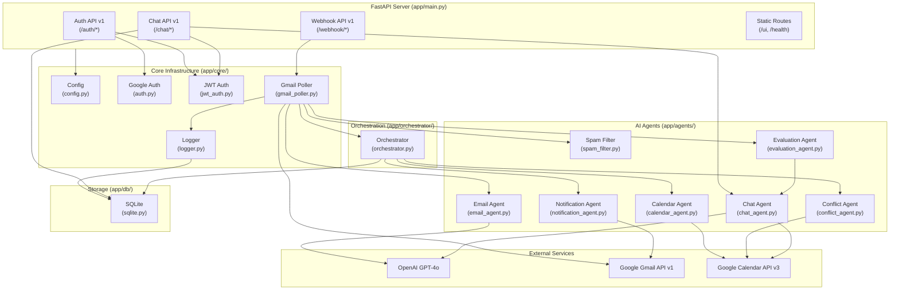
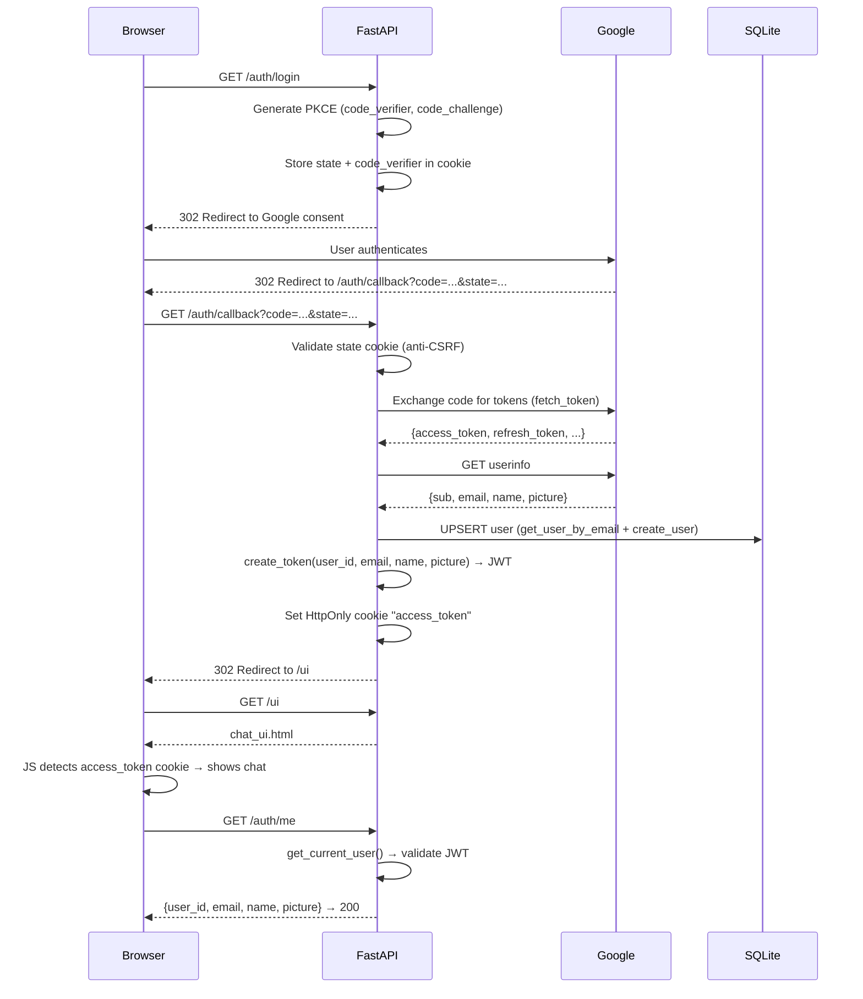
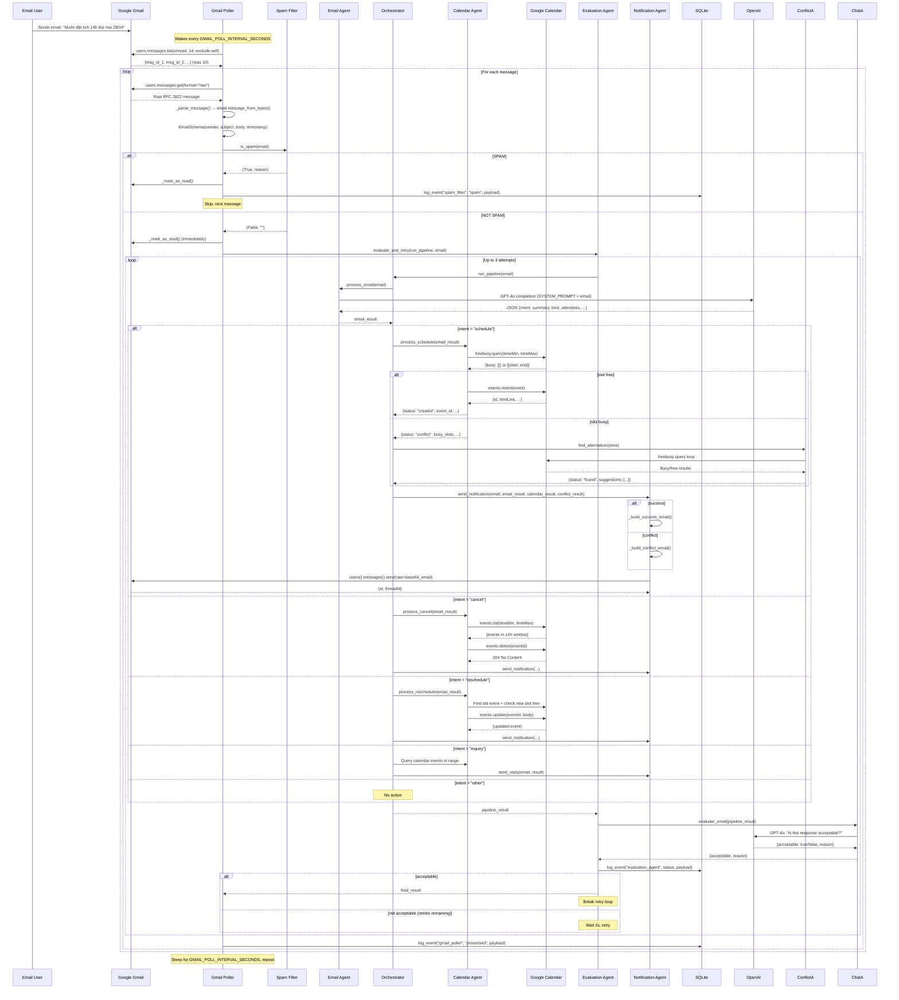
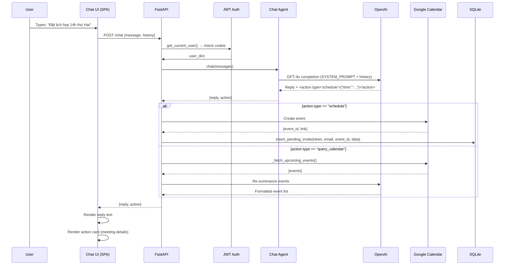
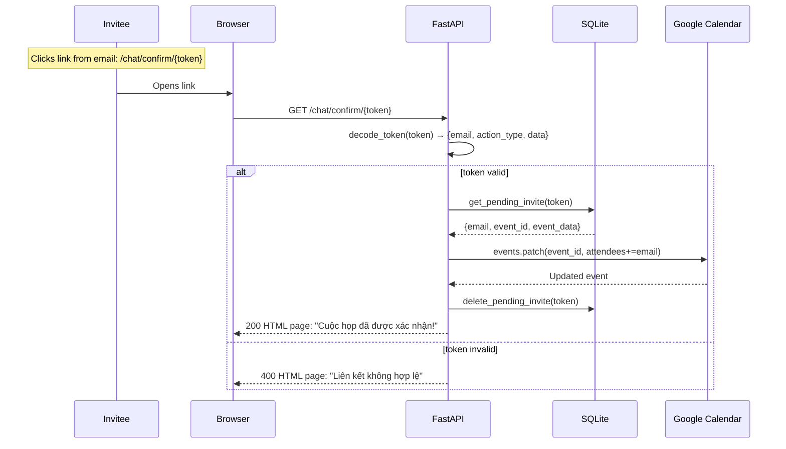
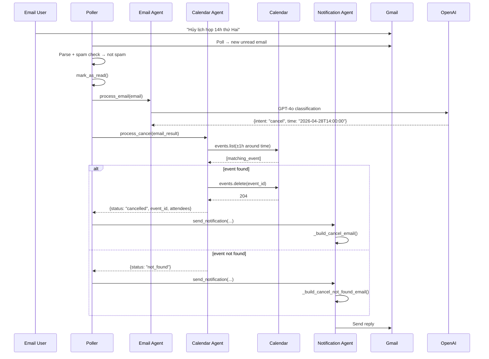
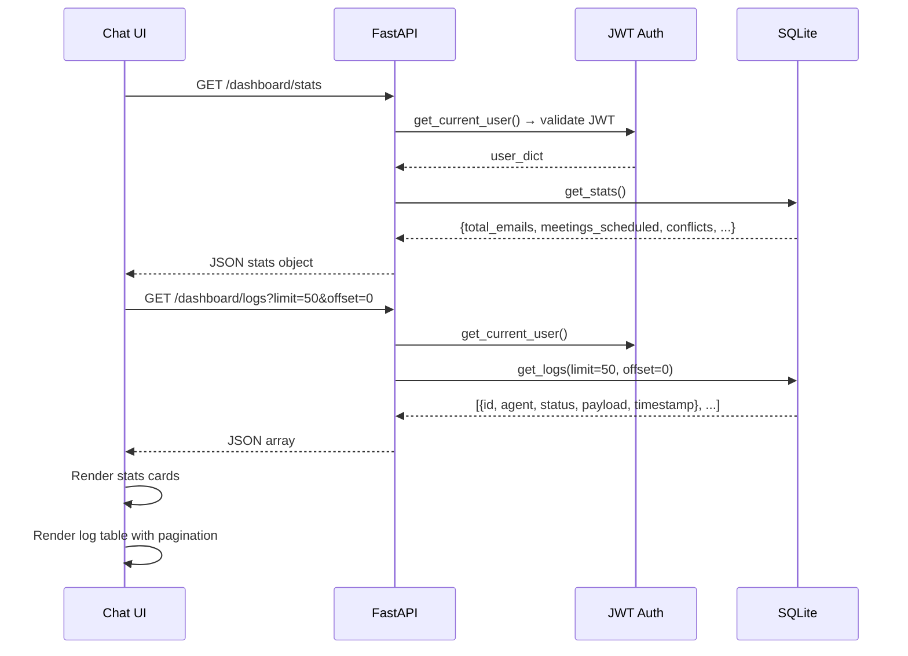
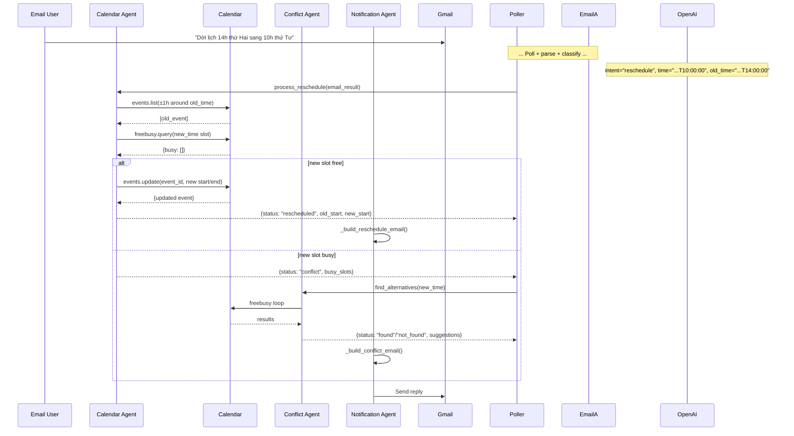
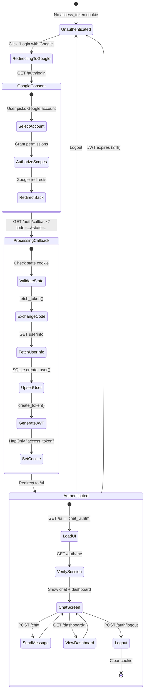

# Email Scheduler AI — Architecture Overview

> **Repository:** `email_scheduler_ai` | **Commit:** `c9e73fcd` | **Date:** 2026-06-08

---

## 1. High-Level Architecture

### System Context

```mermaid
C4Context
    title System Context Diagram — Email Scheduler AI

    Person(email_user, "Email User", "Sends meeting requests via email")
    Person(chat_user, "Chat User", "Schedules via web chat UI")
    Person(invitee, "Meeting Invitee", "Confirms/declines meetings via link")

    System(email_scheduler, "Email Scheduler AI", "Automated meeting scheduling\nwith AI + Google Calendar")

    System_Ext(gmail, "Google Gmail", "Email API v1")
    System_Ext(calendar, "Google Calendar", "Calendar API v3")
    System_Ext(openai, "OpenAI GPT-4o", "LLM for intent classification + chat")

    Rel(email_user, "Sends email to", gmail, "SMTP")
    Rel(gmail, "Pushes notification", email_scheduler, "Webhook / Poll")
    Rel(email_scheduler, "Reads inbox", gmail, "Gmail API")
    Rel(email_scheduler, "Classifies + chats", openai, "REST API")
    Rel(email_scheduler, "Manages events", calendar, "Calendar API")
    Rel(chat_user, "Uses", email_scheduler, "HTTPS /chat")
    Rel(invitee, "Clicks link", email_scheduler, "HTTPS /chat/{action}/{token}")
    Rel(email_scheduler, "Sends replies", gmail, "Gmail API")
```

### Container Diagram

```mermaid
C4Container
    title Container Diagram

    Person(user, "User", "Email or Chat user")

    Container_Boundary(app, "Email Scheduler AI Application") {
        Container(api, "FastAPI Server", "Python 3.10+", "Serves REST API, serves chat UI, runs background poller")
        ContainerDb(db, "SQLite Database", "File DB", "Stores system_logs, pending actions, users")
        Container(spa, "Chat SPA", "Vanilla HTML/CSS/JS", "Single-file frontend served at /ui")
    }

    System_Ext(gmail, "Google Gmail API v1")
    System_Ext(calendar, "Google Calendar API v3")
    System_Ext(openai, "OpenAI GPT-4o")

    Rel(user, "HTTPS", api, "REST + UI")
    Rel(api, "Read/Send", gmail, "OAuth 2.0")
    Rel(api, "CRUD", calendar, "OAuth 2.0")
    Rel(api, "Completion", openai, "API Key")
    Rel(api, "Read/Write", db, "sqlite3")
    Rel(spa, "fetch()", api, "Cookies")
```

### Component Diagram



---

## 2. System Architecture (Layered)

```
┌─────────────────────────────────────────────────────────────┐
│                    PRESENTATION LAYER                        │
│  ┌──────────────────────┐  ┌──────────────────────────────┐ │
│  │   chat_ui.html       │  │  REST API Endpoints          │ │
│  │   SPA (1623 lines)   │  │  15 routes across 4 groups   │ │
│  └──────────────────────┘  └──────────────────────────────┘ │
├─────────────────────────────────────────────────────────────┤
│                    APPLICATION LAYER                         │
│  ┌──────────────────────────────────────────────────────┐   │
│  │              Orchestrator (orchestrator.py)          │   │
│  │         Routes email intents to agent pipelines      │   │
│  └──────────────────────────────────────────────────────┘   │
│  ┌──────┐ ┌──────┐ ┌──────┐ ┌──────┐ ┌──────┐ ┌──────┐    │
│  │Spam  │ │Email │ │Calen-│ │Conf- │ │Chat  │ │Notif-│    │
│  │Filter│ │Agent │ │dar   │ │lict  │ │Agent │ │ication│   │
│  │      │ │      │ │Agent │ │Agent │ │      │ │Agent │    │
│  └──────┘ └──────┘ └──────┘ └──────┘ └──────┘ └──────┘    │
│                    ┌──────────┐                             │
│                    │Evaluation│                             │
│                    │  Agent   │                             │
│                    └──────────┘                             │
├─────────────────────────────────────────────────────────────┤
│                    INFRASTRUCTURE LAYER                      │
│  ┌────────┐ ┌────────┐ ┌────────┐ ┌────────┐ ┌──────────┐ │
│  │Config  │ │Google  │ │JWT     │ │Logger  │ │Gmail     │ │
│  │Settings│ │Auth    │ │Auth    │ │        │ │Poller    │ │
│  └────────┘ └────────┘ └────────┘ └────────┘ └──────────┘ │
├─────────────────────────────────────────────────────────────┤
│                    DATA LAYER                                │
│  ┌──────────────────────────────────────────────────────┐   │
│  │              SQLite Database (sqlite.py)              │   │
│  │  system_logs | pending_invites | pending_cancels      │   │
│  │  pending_reschedules | users                          │   │
│  └──────────────────────────────────────────────────────┘   │
├─────────────────────────────────────────────────────────────┤
│                    EXTERNAL SERVICES                         │
│  ┌──────────┐  ┌──────────────┐  ┌────────────────────┐    │
│  │ OpenAI   │  │ Google Gmail │  │ Google Calendar    │    │
│  │ GPT-4o   │  │ API v1       │  │ API v3             │    │
│  └──────────┘  └──────────────┘  └────────────────────┘    │
└─────────────────────────────────────────────────────────────┘
```

---

## 3. Data Flow Diagrams

### Flow 1: Login (Google OAuth)



**Source files:**
- `app/api/v1/auth.py` — routes 73–252
- `app/core/jwt_auth.py` — token create/decode/validate
- `app/db/sqlite.py` — user CRUD
- `app/core/config.py` — Google OAuth config
- `app/chat_ui.html` — frontend state handling

### Flow 2: Schedule Meeting (Email Path)



**Source files:**
- `app/core/gmail_poller.py` — polling + message parsing
- `app/agents/spam_filter.py` — spam detection
- `app/agents/email_agent.py` — GPT-4o intent classification
- `app/agents/calendar_agent.py` — Calendar CRUD
- `app/agents/conflict_agent.py` — alternative slots
- `app/agents/notification_agent.py` — email templates + send
- `app/agents/evaluation_agent.py` — retry + evaluation
- `app/orchestrator/orchestrator.py` — pipeline routing
- `app/core/logger.py` — event logging

### Flow 3: Schedule Meeting (Chat Path)



**Source files:**
- `app/api/v1/chat.py` — chat endpoint (line 339)
- `app/core/jwt_auth.py` — get_current_user
- `app/agents/chat_agent.py` — chat() function (line 151)
- `app/agents/chat_agent.py` — _fetch_upcoming_events() (line 68)

### Flow 4: Confirmation Link



**Source files:**
- `app/api/v1/chat.py` — confirm (line 458), decline (line 497), reschedule_confirm (line 520), reschedule_decline (line 594), cancel_confirm (line 639)
- `app/core/jwt_auth.py` — decode_token()
- `app/db/sqlite.py` — pending_invites CRUD

### Flow 5: Cancel Meeting Flow



**Source files:**
- `app/agents/calendar_agent.py:123-194` — process_cancel()
- `app/agents/notification_agent.py` — email template builders

### Flow 6: Dashboard Statistics



**Source files:**
- `app/api/v1/chat.py:693` — dashboard_stats endpoint
- `app/api/v1/chat.py:715` — dashboard_logs endpoint
- `app/db/sqlite.py:95-118` — get_stats()
- `app/db/sqlite.py:55-64` — get_logs()

### Flow 7: Reschedule Flow



**Source files:**
- `app/agents/calendar_agent.py:197-301` — process_reschedule()
- `app/agents/conflict_agent.py:93-154` — find_alternatives()

---

## 4. Request Lifecycle (API-Focused)

### Email Processing Pipeline

```
INCOMING EMAIL
    │
    ▼
┌─────────────────────┐
│ 1. Gmail Poller     │  poll_gmail() — gmail_poller.py:59
│    Poll for unread   │  Infinite async loop
│    Parse raw message │  _parse_message() — gmail_poller.py:18
└────────┬────────────┘
         │ EmailSchema
         ▼
┌─────────────────────┐
│ 2. Spam Filter      │  is_spam() — spam_filter.py:68
│    Keyword matching  │  44 keyword patterns
│    Sender/Subject/Body│  Returns (bool, reason)
└────────┬────────────┘
         │ Not spam
         ▼
┌─────────────────────┐
│ 3. Mark as Read     │  _mark_as_read() — gmail_poller.py:47
│    Gmail API modify  │  removeLabelIds=["UNREAD"]
└────────┬────────────┘
         │
         ▼
┌─────────────────────┐
│ 4. Retry Wrapper    │  evaluate_and_retry() — evaluation_agent.py:32
│    Up to 3 attempts  │  Wraps run_pipeline()
│    2s delay between  │
└────────┬────────────┘
         │ Calls run_pipeline()
         ▼
┌─────────────────────┐
│ 5. Email Classifier │  process_email() — email_agent.py:73
│    GPT-4o            │  {intent, summary, time, attendees...}
└────────┬────────────┘
         │ email_result
         ▼
┌─────────────────────┐
│ 6. Orchestrator     │  run_pipeline() — orchestrator.py
│    Route by intent   │
│    schedule → calendar_agent
│    cancel   → calendar_agent
│    reschedule → calendar_agent
│    inquiry  → calendar query
│    other    → skip
│    conflict → conflict_agent
│    always   → notification_agent
└────────┬────────────┘
         │ pipeline_result
         ▼
┌─────────────────────┐
│ 7. LLM Evaluator    │  evaluate_email() — chat_agent.py:123
│    GPT-4o checks     │  {acceptable: bool, reason: str}
│    quality of output  │
└────────┬────────────┘
         │ Evaluated result
         ▼
┌─────────────────────┐
│ 8. Database Log     │  log_event() — logger.py
│    system_logs table  │  {agent, status, payload, timestamp}
└─────────────────────┘
```

---

## 5. Authentication Flow Detail



---

## 6. Component Interaction Matrix

| Component | Config | Auth | JWT | SQLite | Spam | Email | Cal | Conflict | Chat | Notif | Eval | Orchestrator | Poller | Gmail API | Cal API | OpenAI |
|-----------|--------|------|-----|--------|------|-------|-----|---------|------|-------|------|-------------|--------|-----------|---------|--------|
| **main.py** | ✓ | — | — | ✓ (init) | — | — | — | — | — | — | — | — | ✓ (start) | — | — | — |
| **auth_router** | ✓ | ✓ | ✓ | ✓ | — | — | — | — | — | — | — | — | — | — | — | — |
| **chat_router** | — | — | ✓ | ✓ | — | — | — | — | ✓ | — | — | — | — | — | — | — |
| **webhook_router**| — | — | — | — | — | — | — | — | — | — | — | ✓ | — | — | — | — |
| **gmail_poller** | ✓ | ✓ | — | ✓ | ✓ | — | — | — | — | — | ✓ | ✓ | — | ✓ | — | — |
| **email_agent** | ✓ | — | — | — | — | — | — | — | — | — | — | — | — | — | — | ✓ |
| **calendar_agent**| ✓ | ✓ | — | — | — | — | — | — | — | — | — | — | — | — | ✓ | — |
| **conflict_agent**| — | ✓ (own) | — | — | — | — | — | — | — | — | — | — | — | — | ✓ | — |
| **chat_agent** | ✓ | ✓ | — | — | — | — | — | — | — | — | — | — | — | — | ✓ | ✓ |
| **notification_agent**| — | ✓ | — | — | — | — | — | — | — | — | — | — | — | ✓ | — | — |
| **evaluation_agent**| — | — | — | ✓ | — | — | — | — | ✓ | — | — | — | — | — | — | — |
| **orchestrator** | — | — | — | — | — | ✓ | ✓ | ✓ | — | ✓ | — | — | — | — | — | — |

✓ = Direct dependency/call | — = No interaction

---

## 7. Key File Reference

| File | Lines | Primary Role | Key Exports |
|------|-------|-------------|-------------|
| `app/main.py` | 68 | Entry point | FastAPI app, startup, routes |
| `app/core/config.py` | ~50 | Configuration | `Settings` (Pydantic BaseSettings) |
| `app/core/auth.py` | 84 | Google OAuth | `get_gmail_service()`, `get_calendar_service()` |
| `app/core/jwt_auth.py` | 78 | JWT operations | `create_token()`, `decode_token()`, `get_current_user()` |
| `app/core/logger.py` | ~30 | Event logging | `log_event()` |
| `app/core/gmail_poller.py` | 143 | Email ingestion | `poll_gmail()` |
| `app/api/v1/auth.py` | ~252 | User auth | `google_auth_url()`, `callback()`, `me()`, `logout()` |
| `app/api/v1/chat.py` | ~750 | Chat + dashboard | `chat()`, 6 confirmation endpoints, `dashboard_stats()`, `dashboard_logs()` |
| `app/api/v1/webhook.py` | ~30 | Webhook | `gmail_webhook()` |
| `app/agents/spam_filter.py` | ~120 | Spam detection | `is_spam()` |
| `app/agents/email_agent.py` | ~140 | Intent classification | `process_email()` |
| `app/agents/calendar_agent.py` | 301 | Calendar operations | `process_schedule()`, `process_cancel()`, `process_reschedule()` |
| `app/agents/conflict_agent.py` | ~175 | Alternative slots | `find_alternatives()` |
| `app/agents/chat_agent.py` | ~200 | Chat interaction | `chat()`, `evaluate_email()` |
| `app/agents/notification_agent.py` | ~380 | Email reply | `send_notification()`, `send_reply()` |
| `app/agents/evaluation_agent.py` | ~120 | Quality evaluation | `evaluate_and_retry()` |
| `app/orchestrator/orchestrator.py` | ~150 | Pipeline routing | `run_pipeline()` |
| `app/db/sqlite.py` | 118 | Database layer | `init_db()`, `get_logs()`, `get_stats()`, user + pending CRUD |
| `app/schemas/email.py` | ~20 | Data models | `EmailSchema` |
| `app/chat_ui.html` | 1623 | Frontend SPA | Chat UI + Dashboard (vanilla JS) |

---

*End of Architecture Overview*