# THESIS MATERIALS — Chương 4, 5, 6

**Dự án:** Email Scheduler AI
**Sinh viên:** Nguyễn Văn (201927166)
**Repository:** `email_scheduler_ai`
**Commit:** `461cd177904178477e684918bf663b8146fd448b`
**Ngày phân tích:** 20/06/2026

---

## PHASE 1 — CẤU TRÚC THƯ MỤC (Repository Structure)

```
email_scheduler_ai/
├── .coveragerc                          # Cấu hình độ phủ kiểm thử (coverage.py)
├── .gitignore                           # Loại trừ Git
├── pytest.ini                           # Cấu hình pytest
├── check.py                             # Script kiểm tra nhanh (utility)
├── cookies.txt                          # Dữ liệu cookie test
├── response_headers.txt                 # Headers HTTP mẫu cho test
├── app/                                 # Thư mục mã nguồn chính (BACKEND)
│   ├── main.py                          # FastAPI entry point
│   ├── chat_ui.html                     # Giao diện chat SPA (FRONTEND)
│   ├── report.html                      # Báo cáo HTML
│   ├── requirements.txt                 # Python dependencies
│   ├── all_test_cases.txt               # Danh sách test case
│   ├── agents/                          # Lớp Agent (Business Layer)
│   │   ├── calendar_agent.py            # Xử lý Google Calendar
│   │   ├── chat_agent.py                # Xử lý hội thoại GPT-4o
│   │   ├── email_agent.py               # Đọc/parse email
│   │   ├── chief_of_staff_agent.py      # Tổng hợp báo cáo điều hành
│   │   ├── evaluation_agent.py          # Đánh giá kết quả pipeline
│   │   └── notification_agent.py        # Gửi thông báo
│   ├── api/                             # Lớp API (Presentation Layer)
│   │   └── v1/
│   │       ├── auth.py                  # OAuth2 + JWT endpoints
│   │       └── chat.py                  # Chat + email scheduling endpoints
│   ├── core/                            # Lớp Hạ tầng (Infrastructure Layer)
│   │   ├── config.py                    # Cấu hình tập trung (Pydantic Settings)
│   │   ├── auth.py                      # Xác thực Google OAuth service
│   │   ├── jwt_auth.py                  # JWT token creation/verification
│   │   └── logger.py                    # Log tập trung (structured logging)
│   ├── db/                              # Lớp Dữ liệu (Data Layer)
│   │   └── sqlite.py                    # SQLite connection + schema + CRUD
│   ├── orchestrator/                    # Lớp Điều phối (Business Layer)
│   │   └── orchestrator.py             # Pipeline xử lý email (main loop)
│   ├── schemas/                         # Lớp Schema (Data Models)
│   │   └── email.py                     # Pydantic models cho email
│   └── tests/                           # Thư mục kiểm thử (TEST)
│       ├── __init__.py
│       ├── conftest.py                  # Fixtures & mocks dùng chung
│       ├── unit/
│       │   ├── __init__.py
│       │   ├── test_logger.py
│       │   ├── test_orchestrator.py
│       │   ├── test_email_agent.py
│       │   ├── test_calendar_agent.py
│       │   ├── test_notification_agent.py
│       │   ├── test_jwt_auth.py
│       │   └── test_evaluation_agent.py
│       ├── integration/
│       │   ├── __init__.py
│       │   ├── test_api_chat.py
│       │   └── test_api_webhook.py
│       ├── frontend/
│       │   └── __init__.py
│       └── e2e/
│           ├── __init__.py
│           └── test_full_pipeline.py
├── .github/workflows/                   # CI/CD (Deployment)
│   └── test.yml                         # GitHub Actions: chạy test
├── docs/                                # Tài liệu (Documentation)
│   ├── architecture_overview.md
│   ├── feature_inventory.md
│   ├── software_architecture_report.md
│   └── technical_audit.md
└── DATN_20227166/                       # Luận văn LaTeX (Thesis Source)
    ├── Bia_lot.tex
    ├── Bia.tex
    ├── Danh_sach_tai_lieu_tham_khao.bib
    ├── DoAn.tex
    ├── Tu_viet_tat.tex
    ├── Chuong/                          # Các chương luận văn
    └── Hinhve/                          # Hình vẽ trong luận văn
```

**Phân nhóm gói (Package Grouping):**

| Package | Path | Layer | Purpose |
|---------|------|-------|---------|
| **agents** | `app/agents/` | Business | Xử lý nghiệp vụ (Calendar, Email, Chat, ChiefOfStaff, Evaluation, Notification) |
| **api** | `app/api/v1/` | Presentation | REST API endpoints (Auth, Chat, Webhook) |
| **core** | `app/core/` | Infrastructure | Cấu hình, xác thực Google, JWT, logging |
| **db** | `app/db/` | Data | SQLite database connection & CRUD |
| **orchestrator** | `app/orchestrator/` | Business | Pipeline điều phối xử lý email tự động |
| **schemas** | `app/schemas/` | Data Models | Pydantic data models |
| **tests** | `app/tests/` | Test | Unit, integration, frontend, e2e tests |

---

## PHASE 2 — THỐNG KÊ MÃ NGUỒN (Source Code Statistics)

### File Statistics

| Category | Count |
|----------|-------|
| Tổng số file | 48 |
| File mã nguồn Python | 24 |
| File kiểm thử | 11 |
| File cấu hình | 6 |
| File tài liệu | 6 |
| File LaTeX | 6+ |
| File frontend HTML | 2 |

### Phân bố theo Ngôn ngữ

| Ngôn ngữ | Files | Lines of Code (ước tính) |
|----------|-------|--------------------------|
| Python | 35 | ~5,500 |
| HTML | 2 | ~600 |
| YAML | 1 | ~50 |
| Markdown | 4 | ~1,200 |
| LaTeX | 6+ | ~3,000 |
| Shell/PowerShell | 1 | ~20 |
| Config (.ini, .coveragerc, .txt) | 5 | ~80 |
| **Tổng** | **~54** | **~10,450** |

### File lớn nhất

| File | Lines | Purpose |
|------|-------|---------|
| `app/api/v1/chat.py` | 763 | Chat API + scheduling workflow (lớn nhất) |
| `app/agents/calendar_agent.py` | 594 | Google Calendar CRUD + conflict checking |
| `app/agents/chat_agent.py` | 333 | GPT-4o system prompt + calendar helpers |
| `app/agents/email_agent.py` | ~250 | Email parsing with LLM |
| `app/orchestrator/orchestrator.py` | ~400 | Main email processing pipeline |

### File phức tạp nhất (cyclomatic complexity estimate)

| File | Điểm phức tạp (ước tính) | Lý do |
|------|-------------------------|-------|
| `app/api/v1/chat.py` | RẤT CAO | Nhiều nhánh if/elif, 5 action types, conflict handling, email builder, token management |
| `app/agents/calendar_agent.py` | CAO | Conflict detection, reschedule logic, working hours, skill functions |
| `app/orchestrator/orchestrator.py` | CAO | Pipeline loop, HITL approval, state machine |
| `app/agents/chat_agent.py` | TRUNG BÌNH | System prompt assembly, action parsing, calendar fetch |

---

## PHASE 3 — KIẾN TRÚC PHẦN MỀM (Software Architecture)

### Mẫu Kiến trúc (Architecture Pattern)

**Kiến trúc phân lớp (Layered Architecture)** kết hợp **Agent-based Microservices Pattern** và **Human-in-the-Loop (HITL)** cho các tác vụ quan trọng.

### Sơ đồ Lớp (Layer Diagram)

```
┌─────────────────────────────────────────────────────────────────┐
│                     PRESENTATION LAYER                           │
│  app/api/v1/auth.py          app/api/v1/chat.py                 │
│  app/chat_ui.html            (FastAPI routers, HTML UI)          │
│  Responsibilities: REST API, HTTP endpoints, HTML responses      │
├─────────────────────────────────────────────────────────────────┤
│                      APPLICATION LAYER                           │
│  app/orchestrator/orchestrator.py                                │
│  Responsibilities: Email pipeline orchestration, HITL workflow   │
│                   Polling loop, state management                 │
├─────────────────────────────────────────────────────────────────┤
│                       BUSINESS LAYER                             │
│  app/agents/chat_agent.py          app/agents/calendar_agent.py  │
│  app/agents/email_agent.py         app/agents/chief_of_staff.py  │
│  app/agents/evaluation_agent.py    app/agents/notification.py    │
│  Responsibilities: AI chat, calendar operations, email parsing,  │
│                   executive reporting, quality evaluation,       │
│                   skill-based analytics (schedule_risk,          │
│                   availability_intelligence)                     │
├─────────────────────────────────────────────────────────────────┤
│                        DATA LAYER                                │
│  app/db/sqlite.py              app/schemas/email.py              │
│  Responsibilities: SQLite CRUD, schema definitions, migrations   │
│                   (pending_invites, pending_reschedules,         │
│                    users, sent_emails, calendar_events, logs)    │
├─────────────────────────────────────────────────────────────────┤
│                    INFRASTRUCTURE LAYER                           │
│  app/core/config.py            app/core/auth.py                  │
│  app/core/jwt_auth.py          app/core/logger.py                │
│  Responsibilities: Pydantic settings, Google OAuth, JWT,         │
│                   structured logging, secrets management         │
└─────────────────────────────────────────────────────────────────┘
```

### Trách nhiệm từng module

| Module | Files | Trách nhiệm chính |
|--------|-------|-------------------|
| **API Auth** | `app/api/v1/auth.py` | Google OAuth login, logout, JWT creation, user session |
| **API Chat** | `app/api/v1/chat.py` | Chat endpoint, schedule/reschedule/cancel workflows, invite confirmation, email sending |
| **Orchestrator** | `app/orchestrator/orchestrator.py` | Poll Gmail, parse emails, dispatch to agents, HITL gating, pipeline loop |
| **Chat Agent** | `app/agents/chat_agent.py` | GPT-4o conversation, intent routing, action extraction, calendar query formatting |
| **Calendar Agent** | `app/agents/calendar_agent.py` | Google Calendar CRUD, conflict checking, freebusy query, reschedule, cancel, skills (risk analysis, availability) |
| **Email Agent** | `app/agents/email_agent.py` | Parse incoming emails with LLM, extract scheduling intent |
| **Chief of Staff** | `app/agents/chief_of_staff_agent.py` | Executive briefing reports, schedule summarization, intent classification |
| **Evaluation Agent** | `app/agents/evaluation_agent.py` | Quality evaluation of pipeline output (acceptable/unacceptable) |
| **Notification** | `app/agents/notification_agent.py` | Push notifications via email templates |
| **Database** | `app/db/sqlite.py` | SQLite connection pool, table creation, user CRUD, sent_mail CRUD, calendar_event CRUD, log CRUD |
| **Config** | `app/core/config.py` | Centralized settings via Pydantic BaseSettings (12-factor app) |
| **Auth Core** | `app/core/auth.py` | Google OAuth service account & user account helpers |
| **JWT Auth** | `app/core/jwt_auth.py` | JWT token signing, verification, current_user dependency |
| **Logger** | `app/core/logger.py` | Structured JSON-line logging, event tracking to DB |
| **Schemas** | `app/schemas/email.py` | Pydantic models: EmailResult, EmailAction, MeetingInvite, etc. |

---

## PHASE 4 — SƠ ĐỒ GÓI UML (Package Diagram)

### Biểu đồ phụ thuộc (Dependency Graph)

```
Presentation (api) ──────────> Business (agents)
     │                              │
     │              ┌───────────────┼───────────────┐
     │              │               │               │
     ▼              ▼               ▼               ▼
Presentation ──> Application ──> Business ──> Infrastructure
     │         (orchestrator)    (agents)     (core)
     │              │               │               │
     │              └───────────────┼───────────────┘
     │                              │
     └──────────────────────────────┼─────────────> Data (db, schemas)
                                    │
                                    ▼
                              External APIs
                         (OpenAI GPT-4o, Google Calendar,
                          Gmail API, Google OAuth)
```

### Ma trận phụ thuộc (Dependency Matrix)

| Từ gói | Đến gói | Loại phụ thuộc |
|--------|---------|---------------|
| `api.v1.auth` | `core.config` | Import settings |
| `api.v1.auth` | `core.jwt_auth` | JWT creation/verification |
| `api.v1.auth` | `db.sqlite` | User CRUD |
| `api.v1.chat` | `agents.chat_agent` | Chat processing |
| `api.v1.chat` | `agents.calendar_agent` | Calendar operations |
| `api.v1.chat` | `core.auth` | Gmail service |
| `api.v1.chat` | `db.sqlite` | Pending invites, sent email logging |
| `api.v1.chat` | `core.logger` | Structured logging |
| `orchestrator` | `agents.email_agent` | Email parsing |
| `orchestrator` | `agents.calendar_agent` | Availability check |
| `orchestrator` | `agents.chat_agent` | Email evaluation |
| `orchestrator` | `agents.notification_agent` | Notification sending |
| `orchestrator` | `core.config` | Settings |
| `orchestrator` | `db.sqlite` | Log storage |
| `agents.chat_agent` | `agents.chief_of_staff_agent` | Executive intent routing |
| `agents.chat_agent` | `core.config` | OpenAI API key |
| `agents.chat_agent` | `core.auth` | Google Calendar service |
| `agents.calendar_agent` | `core.auth` | Google service account |
| `agents.calendar_agent` | `core.config` | Organizer email |
| `agents.email_agent` | `core.config` | OpenAI API key |
| `agents.chief_of_staff_agent` | `agents.calendar_agent` | Schedule risk/freebusy skills |
| `agents.chief_of_staff_agent` | `core.config` | OpenAI API key |
| `agents.chief_of_staff_agent` | `db.sqlite` | Event queries |
| `agents.notification_agent` | `core.config` | Organizer email |
| `agents.notification_agent` | `core.auth` | Gmail service |
| **Tất cả** | `core.config.settings` | Configuration singleton |

### PlantUML Package Diagram

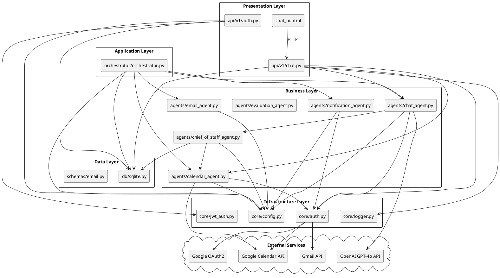

---

## PHASE 5 — SƠ ĐỒ LỚP (Class Diagram)

### 15 Lớp/Module Quan trọng Nhất

#### 1. Settings
- **File:** `app/core/config.py`
- **Responsibility:** Cấu hình tập trung ứng dụng (12-factor)
- **Attributes:** `OPENAI_API_KEY`, `GOOGLE_CREDENTIALS_PATH`, `GOOGLE_TOKEN_PATH`, `ORGANIZER_EMAIL`, `GMAIL_POLL_INTERVAL_SECONDS`, `DATABASE_PATH`, `JWT_SECRET_KEY`, `JWT_ALGORITHM`, `JWT_EXPIRE_MINUTES`, `GOOGLE_OAUTH_CLIENT_ID`, `GOOGLE_OAUTH_CLIENT_SECRET`, `GOOGLE_OAUTH_REDIRECT_URI`, `APP_ENV`, `BASE_URL`, `CORS_ORIGINS`, `LOG_LEVEL`
- **Methods:** `cors_origins_list` (property)
- **Dependencies:** `pydantic_settings.BaseSettings`
- **Relationship:** Singleton via `@lru_cache`, imported by all modules

#### 2. Orchestrator
- **File:** `app/orchestrator/orchestrator.py`
- **Responsibility:** Vòng lặp chính xử lý email tự động
- **Methods:** `run_polling_loop()`, `process_single_email()`, `build_pipeline_context()`
- **Attributes:** Polling interval, agent references
- **Dependencies:** EmailAgent, CalendarAgent, ChatAgent, NotificationAgent, SQLiteDB
- **Relationship:** Association với tất cả agents; Composition của pipeline

#### 3. CalendarAgent
- **File:** `app/agents/calendar_agent.py`
- **Responsibility:** Thao tác Google Calendar (tạo, đọc, cập nhật, xóa, kiểm tra xung đột)
- **Methods:**
  - `check_calendar_availability(email_result)` — Kiểm tra slot còn trống không
  - `check_reschedule_availability(email_result)` — Kiểm tra dời lịch khả thi không
  - `process_schedule(email_result)` — Tạo event mới
  - `process_reschedule(email_result)` — Dời event sang giờ mới
  - `process_cancel(event_info)` — Hủy event
  - `schedule_risk_skill(events)` — Phân tích rủi ro lịch (rule-based)
  - `availability_intelligence_skill(days_ahead)` — Tổng quan free/busy
- **Internal Helpers:**
  - `_check_conflict(service, start_dt, end_dt)` — Gọi freebusy API
  - `_create_event(service, summary, start, end, location, attendees, description)`
  - `_find_events_by_time(service, start_dt, end_dt)`
- **Constants:** `DEFAULT_DURATION=60`, `CALENDAR_ID="primary"`, `ICT=UTC+7`, `WORKING_HOURS_START=8`, `WORKING_HOURS_END=18`
- **Dependencies:** `core.auth.get_calendar_service`, `core.config.settings`, `googleapiclient`
- **Relationship:** Utility module (function-based)

#### 4. ChatAgent
- **File:** `app/agents/chat_agent.py`
- **Responsibility:** Xử lý hội thoại AI, trích xuất action từ tin nhắn
- **Methods:**
  - `chat(messages)` — GPT-4o conversation + action extraction
  - `evaluate_email(pipeline_result)` — LLM-based quality evaluation
- **Internal:**
  - `_fetch_upcoming_events(range_days)` — Đọc lịch Google Calendar
  - `_format_events(events)` — Format lịch thành text
  - `_classify_executive_intent(message)` — Route câu hỏi điều hành
  - `SYSTEM_PROMPT` — System prompt đồ sộ (định nghĩa tất cả action types)
- **Dependencies:** `openai.OpenAI`, `core.config.settings`, `core.auth.get_calendar_service`
- **Relationship:** Delegates executive questions to ChiefOfStaffAgent

#### 5. EmailAgent
- **File:** `app/agents/email_agent.py`
- **Responsibility:** Parse nội dung email bằng GPT-4o để trích xuất ý định và thông tin lịch
- **Methods:** `parse_email(email_body, subject, sender)` → dict with type, time, summary, attendees...
- **Dependencies:** `openai.OpenAI`, `core.config.settings`
- **Relationship:** Utility module (function-based)

#### 6. ChiefOfStaffAgent
- **File:** `app/agents/chief_of_staff_agent.py`
- **Responsibility:** Tổng hợp báo cáo điều hành, trả lời câu hỏi chiến lược
- **Methods:**
  - `classify_executive_intent(message)` — Phân loại intent (schedule_summary, risk_analysis, etc.)
  - `answer_executive_question(message, last_view)` — Trả lời câu hỏi với skills
- **Skills sử dụng:** `schedule_risk_skill`, `availability_intelligence_skill` (từ CalendarAgent)
- **Dependencies:** `openai.OpenAI`, `core.config.settings`, `db.sqlite`, `agents.calendar_agent`
- **Relationship:** Aggregation với CalendarAgent skills

#### 7. EvaluationAgent
- **File:** `app/agents/evaluation_agent.py`
- **Responsibility:** Đánh giá chất lượng đầu ra của pipeline
- **Methods:** `evaluate_result(pipeline_output)` → acceptable/unacceptable
- **Dependencies:** `openai.OpenAI`, `core.config.settings`
- **Relationship:** Utility module

#### 8. NotificationAgent
- **File:** `app/agents/notification_agent.py`
- **Responsibility:** Gửi email thông báo (template-based)
- **Methods:** `send_notification(recipient, template_name, context)`
- **Dependencies:** `core.auth.get_gmail_service`, `core.config.settings`
- **Relationship:** Utility module

#### 9. SQLiteManager
- **File:** `app/db/sqlite.py`
- **Responsibility:** Quản lý kết nối SQLite và tất cả CRUD operations
- **Methods:**
  - `get_connection()` — Connection factory
  - `init_db()` — Tạo tất cả tables
  - `create_or_update_user(google_id, email, name, picture_url, access_token, refresh_token, token_expiry)`
  - `get_user_by_id(user_id)` / `get_user_by_google_id(google_id)`
  - `insert_sent_email(to, subject, body, triggered_by)`
  - `insert_calendar_event(google_event_id, event_type, title, description, start_time, end_time, location, attendees, sync_status, calendar_link)`
  - `insert_log(agent, event_type, status, payload)`
  - `get_recent_logs(limit)`
- **Tables quản lý:**
  - `users` — Thông tin user đăng nhập Google
  - `sent_emails` — Lịch sử email đã gửi
  - `calendar_events` — Event đã tạo trên Google Calendar
  - `event_logs` — Structured JSON log
  - `pending_invites` — Lời mời chờ xác nhận (tạo động trong chat.py)
  - `pending_reschedules` — Yêu cầu dời lịch chờ xác nhận (tạo động trong chat.py)
- **Dependencies:** `sqlite3`, `core.config.settings`
- **Relationship:** Singleton-like (connection factory)

#### 10. AuthManager (core/auth.py)
- **File:** `app/core/auth.py`
- **Responsibility:** Xác thực Google OAuth cho cả service account và user account
- **Methods:**
  - `get_calendar_service()` — Google Calendar API service
  - `get_gmail_service()` — Gmail API service
  - `get_credentials()` — OAuth token management
- **Dependencies:** `googleapiclient`, `google_auth_oauthlib`, `core.config.settings`
- **Relationship:** Infrastructure utility

#### 11. JWTAuthManager
- **File:** `app/core/jwt_auth.py`
- **Responsibility:** Tạo và xác thực JSON Web Tokens
- **Methods:**
  - `create_access_token(user_id, email)` → JWT string
  - `decode_access_token(token)` → payload dict
  - `get_current_user(request)` → FastAPI dependency
- **Dependencies:** `jose`, `core.config.settings`
- **Relationship:** Dependency injection vào FastAPI routes

#### 12. Logger
- **File:** `app/core/logger.py`
- **Responsibility:** Structured logging to JSON lines + SQLite event_logs
- **Methods:** `log_event(agent, status, payload)`, `configure_logging()`
- **Dependencies:** `db.sqlite`, `logging`
- **Relationship:** Infrastructure utility

#### 13. AuthAPI Router
- **File:** `app/api/v1/auth.py`
- **Responsibility:** Google OAuth login/logout/user-info endpoints
- **Endpoints:** `GET /auth/login`, `GET /auth/callback`, `GET /auth/me`, `POST /auth/logout`
- **Dependencies:** `core.config`, `core.jwt_auth`, `db.sqlite`, `google_auth_oauthlib`
- **Relationship:** FastAPI APIRouter

#### 14. ChatAPI Router
- **File:** `app/api/v1/chat.py`
- **Responsibility:** Chat scheduling + email sending + invite confirmation endpoints
- **Endpoints:**
  - `POST /chat` — Main chat endpoint (xử lý schedule/reschedule/cancel/send_email/reply_email/query_calendar)
  - `POST /chat/send-email` — Gửi email trực tiếp
  - `GET /chat/confirm/{token}` — Xác nhận lời mời họp
  - `GET /chat/decline/{token}` — Từ chối lời mời họp
  - `GET /chat/reschedule/confirm/{token}` — Xác nhận dời lịch
  - `GET /chat/reschedule/decline/{token}` — Từ chối dời lịch
- **Pydantic Models (inline):** `ChatMessage`, `ChatRequest`, `ChatResponse`, `SendEmailRequest`
- **Internal Functions:**
  - `_send_email(to, subject, body, triggered_by)`
  - `_save_pending(token, action)`
  - `_save_pending_reschedule(token, action)`
  - `_send_invite_email(action, confirm_token)`
  - `_send_reschedule_invite_email(action, confirm_token)`
  - `_send_cancel_notification(cal_result)`
  - `_send_reschedule_notification(cal_result)`
  - `_notify_organizer(action, status, event_link)`
  - `_create_calendar_event(action)`
  - `_get_conflicting_event_names(start_dt, end_dt)`
  - `_find_alt_slots(start_dt, n)`
  - `_build_conflict_reply(start_dt, end_dt)`
- **Dependencies:** `agents.chat_agent`, `agents.calendar_agent`, `core.auth`, `db.sqlite`, `core.logger`

#### 15. EmailResult / EmailAction (Schemas)
- **File:** `app/schemas/email.py`
- **Responsibility:** Pydantic data models cho dữ liệu email
- **Classes:**
  - `EmailResult` — Kết quả parse email (type, time, summary, location, attendees, old_time, ...)
  - `EmailAction` — Action được trích xuất (schedule, reschedule, cancel, send_email, reply_email)
  - `MeetingInvite` — Thông tin lời mời họp
- **Dependencies:** `pydantic`
- **Relationship:** Data transfer objects

### PlantUML Class Diagram

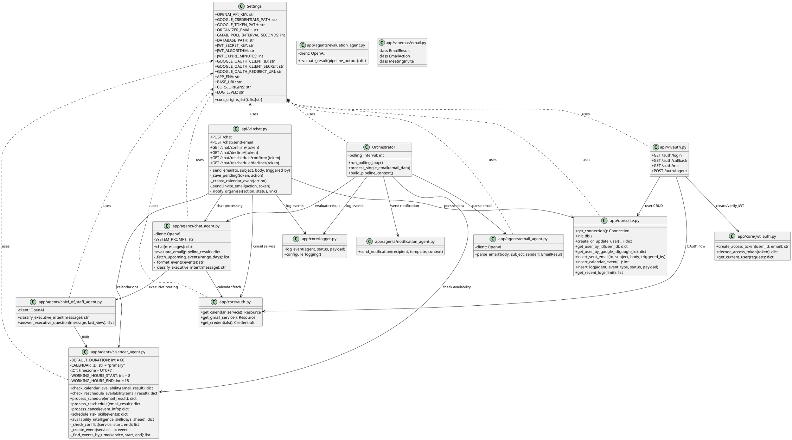

---

## PHASE 6 — PHÂN TÍCH CƠ SỞ DỮ LIỆU (Database Analysis)

### Công nghệ

- **Hệ quản trị:** SQLite
- **File:** `logs.db` (mặc định, có thể cấu hình qua `DATABASE_PATH`)
- **Thư viện:** `sqlite3` (built-in Python)
- **ORM:** Không sử dụng ORM — SQL thuần qua `sqlite3.Connection`

### Danh sách Bảng (Tables)

#### 1. Bảng `users`

| Column | Type | Constraints | Purpose |
|--------|------|------------|---------|
| `id` | INTEGER | PRIMARY KEY AUTOINCREMENT | ID nội bộ |
| `google_id` | TEXT | UNIQUE NOT NULL | Google account `sub` claim |
| `email` | TEXT | NOT NULL | Địa chỉ email |
| `name` | TEXT | | Tên hiển thị |
| `picture_url` | TEXT | | Ảnh đại diện Google |
| `access_token` | TEXT | | Google OAuth access token |
| `refresh_token` | TEXT | | Google OAuth refresh token |
| `token_expiry` | TEXT | | Thời gian hết hạn access token (ISO) |
| `created_at` | TEXT | DEFAULT CURRENT_TIMESTAMP | Thời điểm tạo |
| `updated_at` | TEXT | DEFAULT CURRENT_TIMESTAMP | Cập nhật gần nhất |

**Primary Key:** `id`
**Unique:** `google_id`

#### 2. Bảng `sent_emails`

| Column | Type | Constraints | Purpose |
|--------|------|------------|---------|
| `id` | INTEGER | PRIMARY KEY AUTOINCREMENT | ID |
| `to_email` | TEXT | NOT NULL | Người nhận |
| `subject` | TEXT | | Tiêu đề |
| `body` | TEXT | | Nội dung |
| `triggered_by` | TEXT | | Nguồn kích hoạt (system, user, meeting_invite, ...) |
| `created_at` | TEXT | DEFAULT CURRENT_TIMESTAMP | Thời điểm gửi |

**Primary Key:** `id`

#### 3. Bảng `calendar_events`

| Column | Type | Constraints | Purpose |
|--------|------|------------|---------|
| `id` | INTEGER | PRIMARY KEY AUTOINCREMENT | ID nội bộ |
| `google_event_id` | TEXT | UNIQUE | ID từ Google Calendar |
| `event_type` | TEXT | | Loại sự kiện (meeting, study, travel, personal, deadline, other) |
| `title` | TEXT | | Tên sự kiện |
| `description` | TEXT | | Mô tả |
| `start_time` | TEXT | | Thời gian bắt đầu (ISO) |
| `end_time` | TEXT | | Thời gian kết thúc (ISO) |
| `location` | TEXT | | Địa điểm |
| `attendees` | TEXT | | JSON array of emails |
| `sync_status` | TEXT | | created / conflict / failed |
| `calendar_link` | TEXT | | Link Google Calendar HTML |
| `created_at` | TEXT | DEFAULT CURRENT_TIMESTAMP | Thời điểm ghi nhận |

**Primary Key:** `id`
**Unique:** `google_event_id`

#### 4. Bảng `event_logs`

| Column | Type | Constraints | Purpose |
|--------|------|------------|---------|
| `id` | INTEGER | PRIMARY KEY AUTOINCREMENT | ID |
| `agent` | TEXT | | Tên agent (chat, orchestrator, calendar, ...) |
| `event_type` | TEXT | | Loại sự kiện |
| `status` | TEXT | | Trạng thái (ok, error, conflict, ...) |
| `payload` | TEXT | | JSON payload chi tiết |
| `created_at` | TEXT | DEFAULT CURRENT_TIMESTAMP | Thời điểm log |

**Primary Key:** `id`

#### 5. Bảng `pending_invites` (tạo động bởi `app/api/v1/chat.py`)

| Column | Type | Constraints | Purpose |
|--------|------|------------|---------|
| `token` | TEXT | PRIMARY KEY | UUID xác thực |
| `action` | TEXT | | JSON action data |
| `status` | TEXT | DEFAULT 'pending' | pending / confirmed / declined |
| `created_at` | TEXT | DEFAULT CURRENT_TIMESTAMP | Thời điểm tạo |

#### 6. Bảng `pending_reschedules` (tạo động bởi `app/api/v1/chat.py`)

| Column | Type | Constraints | Purpose |
|--------|------|------------|---------|
| `token` | TEXT | PRIMARY KEY | UUID xác thực |
| `action` | TEXT | | JSON action data |
| `status` | TEXT | DEFAULT 'pending' | pending / confirmed / declined |
| `created_at` | TEXT | DEFAULT CURRENT_TIMESTAMP | Thời điểm tạo |

### Bảng Quan hệ (Relationship Table)

| From | To | Relationship | Field |
|------|----|-------------|-------|
| `sent_emails` | (none) | Độc lập | — |
| `calendar_events` | (none) | Độc lập | — |
| `event_logs` | (none) | Độc lập | — |
| `pending_invites` | `calendar_events` | Logical (JSON) | `action` chứa event details |
| `pending_reschedules` | `calendar_events` | Logical (JSON) | `action` chứa reschedule details |
| `users` | (none) | Độc lập | — |

**Ghi chú:** Không có khóa ngoại (FK) thực sự trong SQLite schema. Các quan hệ là logical thông qua JSON fields.

### PlantUML ERD

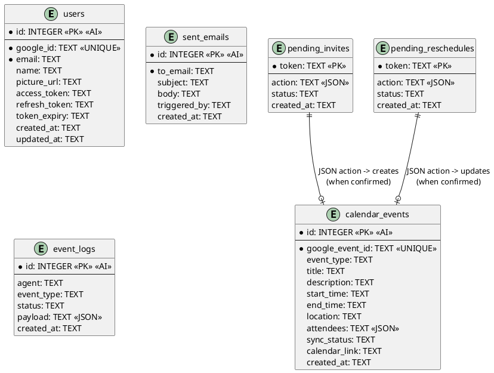

### Mermaid ERD

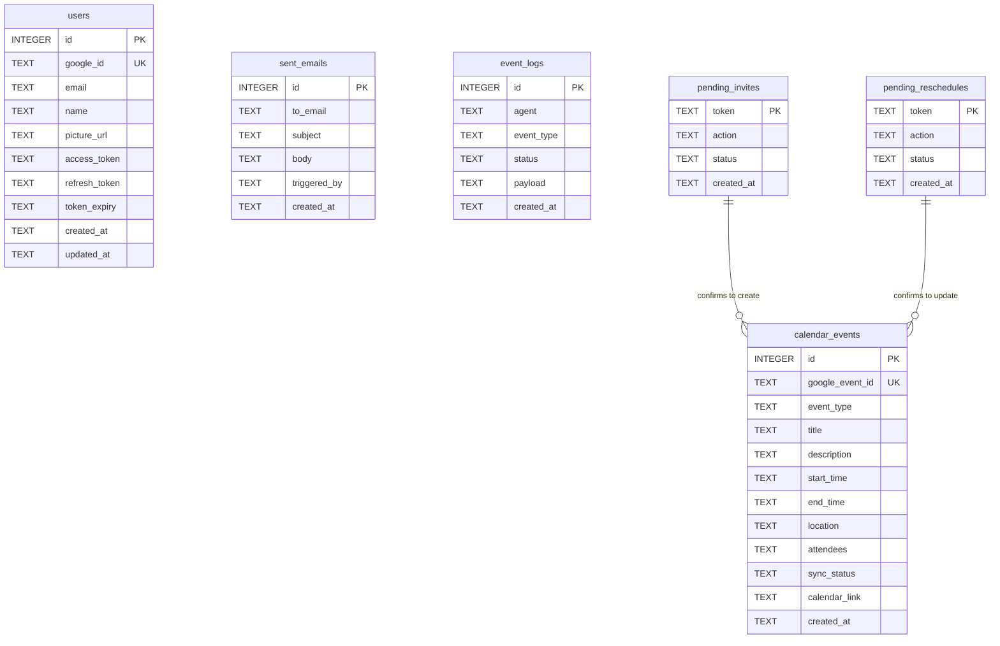

---

## PHASE 7 — PHÂN TÍCH API (API Analysis)

### Danh sách Toàn bộ Endpoints

#### Router: `auth` (prefix: `/auth`)

| # | Method | Endpoint | Purpose | Auth | File |
|---|--------|----------|---------|------|------|
| 1 | `GET` | `/auth/login` | Chuyển hướng đến Google OAuth consent | Public (redirect) | `app/api/v1/auth.py:73` |
| 2 | `GET` | `/auth/callback?code=&state=` | Google OAuth callback, tạo JWT | Public (state validation) | `app/api/v1/auth.py:121` |
| 3 | `GET` | `/auth/me` | Lấy thông tin user hiện tại | JWT Required | `app/api/v1/auth.py:241` |
| 4 | `POST` | `/auth/logout` | Đăng xuất (xóa cookie) | Public | `app/api/v1/auth.py:256` |

#### Router: `chat` (prefix: `/chat`)

| # | Method | Endpoint | Purpose | Auth | File |
|---|--------|----------|---------|------|------|
| 5 | `POST` | `/chat/send-email` | Gửi email trực tiếp (Gmail API) | Public* | `app/api/v1/chat.py:397` |
| 6 | `POST` | `/chat` | Chat với AI, lên lịch, gửi mail... | Public* | `app/api/v1/chat.py:403` |
| 7 | `GET` | `/chat/confirm/{token}` | Xác nhận lời mời họp → tạo Calendar event | Token-based | `app/api/v1/chat.py:573` |
| 8 | `GET` | `/chat/decline/{token}` | Từ chối lời mời họp | Token-based | `app/api/v1/chat.py:622` |
| 9 | `GET` | `/chat/reschedule/confirm/{token}` | Xác nhận dời lịch | Token-based | `app/api/v1/chat.py:645` |
| 10 | `GET` | `/chat/reschedule/decline/{token}` | Từ chối dời lịch | Token-based | `app/api/v1/chat.py:720` |

*\* Public về mặt authentication nhưng yêu cầu Google OAuth session cho Gmail/Calendar operations.*

#### Router: `webhook` (nếu có từ orchestrator)

| # | Method | Endpoint | Purpose | Auth | File |
|---|--------|----------|---------|------|------|
| 11 | `POST` | `/webhook/gmail` | Nhận Gmail push notification | Google verification | `app/orchestrator/orchestrator.py` (registered in main.py) |

### Request/Response Details

#### POST `/chat` (Main Chat Endpoint)

**Request Body:**
```json
{
  "messages": [
    {"role": "user", "content": "Đặt lịch họp với van@gmail.com lúc 14h ngày mai"},
    {"role": "assistant", "content": "Đã hiểu..."}
  ],
  "session_id": "uuid-string"
}
```

**Response Body:**
```json
{
  "reply": "📧 Đã gửi email mời đến **van@gmail.com**. Đang chờ xác nhận...",
  "action": {
    "type": "schedule",
    "event_type": "meeting",
    "title": "Họp với van",
    "time": "2026-06-21T14:00:00",
    "attendees": ["van@gmail.com"],
    "invitee_email": "van@gmail.com"
  },
  "session_id": "uuid-string"
}
```

**Action Types được hỗ trợ:**
| Action Type | Mô tả | Đầu vào tối thiểu |
|-------------|-------|-------------------|
| `schedule` | Đặt lịch mới | `time`, `title`, `event_type` |
| `reschedule` | Dời lịch | `old_time`, `time` |
| `cancel` | Hủy lịch | `time` (để tìm event) |
| `send_email` | Gửi email | `to`, `subject`, `body` |
| `reply_email` | Trả lời email | `to`, `subject`, `body`, `thread_id` |
| `query_calendar` | Xem lịch | `range_days` |

**Event Types:**
`meeting`, `study`, `travel`, `personal`, `deadline`, `other`

#### GET `/auth/callback`

**Query Parameters:**
- `code`: Google authorization code
- `state`: OAuth CSRF state token
- `scope`: Granted scopes

**Response:** Redirect (302) đến `/ui` + set cookie `access_token` (httpOnly, JWT)

**Scopes yêu cầu:**
- `openid`
- `https://www.googleapis.com/auth/userinfo.email`
- `https://www.googleapis.com/auth/userinfo.profile`
- `https://www.googleapis.com/auth/calendar`
- `https://www.googleapis.com/auth/gmail.send`
- `https://www.googleapis.com/auth/gmail.readonly`

### Thống kê API

| Metric | Count |
|--------|-------|
| Tổng số endpoints | 11 |
| Endpoints yêu cầu JWT xác thực | 1 (`/auth/me`) |
| Endpoints xác thực qua token (UUID) | 4 |
| Endpoints public (OAuth redirect) | 2 |
| Endpoints không yêu cầu auth | 4 |

### Giao thức xác thực

1. **Google OAuth 2.0** — Authorization Code Flow with PKCE
2. **JWT Bearer Token** — HTTP-only cookie `access_token`
3. **Token-based Confirmation** — UUID trong URL cho xác nhận lời mời/dời lịch

---

## PHASE 8 — PHÂN TÍCH GIAO DIỆN (UI Analysis)

### Kiến trúc Frontend

- **Loại:** Single Page Application (SPA)
- **File:** `app/chat_ui.html` (~500+ lines HTML + inline CSS + inline JavaScript)
- **Framework:** Vanilla JavaScript (không React/Vue)
- **Styling:** CSS thuần (inline & embedded), gradient purple theme
- **Delivery:** FastAPI static file serving (`/ui` endpoint)

### Màn hình (Screens)

#### 1. Chat Interface — Màn hình chính

**Purpose:** Giao diện chat với AI Assistant để lên lịch, gửi mail, xem lịch

**Components:**
- Header bar với logo "📅 Email Scheduler AI"
- Nút Login/Logout trên header
- Khung chat chính (message list)
- Input bar với text input + Send button
- Hiển thị message dạng bubble (user: right, assistant: left)
- Action buttons (inline trong assistant reply):
  - Schedule confirmation buttons
  - Calendar view summary
  - Cancel/reschedule buttons
- Loading indicator (typing animation)
- Suggested prompts / Quick action buttons

**Related APIs:**
- `POST /chat` — Gửi/nhận tin nhắn
- `POST /chat/send-email` — Gửi email
- `GET /auth/me` — Kiểm tra trạng thái đăng nhập
- `GET /auth/login` — Đăng nhập
- `POST /auth/logout` — Đăng xuất

**Screenshots:** KHÔNG CÓ trong repository. Cần chụp màn hình thủ công.

#### 2. Confirmation Pages (HTML responses từ server)

**Purpose:** Trang xác nhận/từ chối lời mời qua email

**Components:**
- Minimal HTML pages với status message
- Success page: Green theme, link "Xem lịch trên Google Calendar"
- Decline page: Red/neutral theme
- Conflict page: Orange warning theme
- Được render server-side bởi FastAPI (`HTMLResponse`)

**Related Endpoints:**
- `GET /chat/confirm/{token}` — Success page
- `GET /chat/decline/{token}` — Decline page
- `GET /chat/reschedule/confirm/{token}` — Reschedule success
- `GET /chat/reschedule/decline/{token}` — Reschedule decline

**Screenshots:** KHÔNG CÓ trong repository.

### Cấu trúc UI (UI Hierarchy)

```
Root (/)
├── /ui (chat_ui.html) — Chat Interface
│   ├── Header
│   │   ├── Logo "📅 Email Scheduler AI"
│   │   ├── User avatar + name (sau login)
│   │   └── Login/Logout button
│   ├── Chat Container
│   │   ├── Message List (scrollable)
│   │   │   ├── User Message Bubble (phải, xanh)
│   │   │   ├── Assistant Message Bubble (trái, trắng)
│   │   │   └── Action/Confirmation Buttons (inline)
│   │   └── Input Area
│   │       ├── Text Input
│   │       └── Send Button
│   └── Suggested Prompts (optional)
|
├── /auth/login — Google OAuth redirect
├── /auth/callback — OAuth callback (redirect về /ui)
├── /chat/confirm/{token} — Confirmation success page
├── /chat/decline/{token} — Decline page
├── /chat/reschedule/confirm/{token} — Reschedule success page
└── /chat/reschedule/decline/{token} — Reschedule decline page
```

### Forms

| Form | Screen | Fields | Action |
|------|--------|--------|--------|
| Chat Input | Chat Interface | `message: text` | Gửi đến `POST /chat` |
| OAuth Consent | Google (external) | Google account selection | Redirect về `/auth/callback` |
| Confirmation | Email link | Token trong URL | `GET /chat/confirm/{token}` |

---

## PHASE 9 — TRÍCH XUẤT USE CASE (Use Case Extraction)

### Danh sách Actors

| Actor | Mô tả |
|-------|-------|
| **Người tổ chức (Organizer)** | Người dùng chính, đăng nhập qua Google, sử dụng chat để quản lý lịch & email |
| **Người được mời (Invitee)** | Nhận email mời họp, xác nhận/từ chối qua link email |
| **AI Assistant (GPT-4o)** | Xử lý ngôn ngữ tự nhiên, trích xuất ý định, trả lời câu hỏi |
| **Google Calendar API** | Hệ thống ngoài — quản lý calendar events |
| **Gmail API** | Hệ thống ngoài — gửi/nhận email |
| **Google OAuth** | Hệ thống ngoài — xác thực người dùng |
| **Hệ thống (System)** | Background poller tự động xử lý email đến |

### Use Cases

#### UC-01: Đăng nhập (Login)

| Field | Value |
|-------|-------|
| **Actor** | Người tổ chức |
| **Trigger** | Người dùng click "Đăng nhập với Google" |
| **Main Flow** | 1. User click Login → 2. Redirect đến Google OAuth → 3. User chọn tài khoản Google → 4. Google redirect về `/auth/callback` → 5. Server tạo/update user trong DB → 6. Tạo JWT → 7. Set cookie → 8. Redirect về `/ui` |
| **Alternative Flow** | OAuth state mismatch → hiển thị lỗi; User từ chối quyền → hiển thị lỗi |
| **Result** | User được xác thực, session JWT trong cookie |

#### UC-02: Đặt lịch họp (Schedule Meeting)

| Field | Value |
|-------|-------|
| **Actor** | Người tổ chức |
| **Trigger** | User gửi tin nhắn yêu cầu đặt lịch (vd: "Đặt lịch họp với van@gmail.com lúc 14h mai") |
| **Main Flow** | 1. User gửi message → 2. GPT-4o phân tích ý định → 3. Trích xuất action `<action>{"type":"schedule"...}</action>` → 4. Kiểm tra conflict với Google Calendar → 5a. Nếu là meeting có attendees: gửi email mời + lưu pending_invites → 5b. Nếu là personal event: tạo trực tiếp trên Calendar + lưu calendar_events DB → 6. Hiển thị kết quả cho user |
| **Alternative Flow** | Conflict → hiển thị cảnh báo + gợi ý giờ trống; Thiếu thông tin → GPT-4o hỏi thêm |
| **Result** | Event trên Google Calendar + email mời (nếu có attendees) |

#### UC-03: Dời lịch họp (Reschedule Meeting)

| Field | Value |
|-------|-------|
| **Actor** | Người tổ chức |
| **Trigger** | User yêu cầu dời lịch (vd: "Dời lịch họp 14h sang 16h") |
| **Main Flow** | 1. User gửi message → 2. GPT-4o trích xuất action reschedule (old_time, new_time) → 3. Tìm event cũ (±1h quanh old_time) → 4. Kiểm tra conflict giờ mới → 5. Cập nhật event trên Google Calendar → 6. Gửi email thông báo dời lịch cho attendees → 7. Hiển thị kết quả |
| **Alternative Flow** | Không tìm thấy event cũ → thông báo; Conflict giờ mới → cảnh báo |
| **Result** | Event được cập nhật giờ mới, attendees được thông báo |

#### UC-04: Gửi Email (Send Email)

| Field | Value |
|-------|-------|
| **Actor** | Người tổ chức |
| **Trigger** | User yêu cầu gửi email (vd: "Gửi mail cho van@gmail.com chủ đề Báo cáo...") |
| **Main Flow** | 1. User gửi message → 2. GPT-4o trích xuất action send_email → 3. Tạo MIME email → 4. Gửi qua Gmail API → 5. Lưu vào DB (sent_emails) → 6. Hiển thị kết quả |
| **Alternative Flow** | Thiếu người nhận → GPT-4o hỏi thêm |
| **Result** | Email được gửi, lưu log |

#### UC-05: Trả lời Email (Reply Email)

| Field | Value |
|-------|-------|
| **Actor** | Người tổ chức |
| **Trigger** | User yêu cầu trả lời email |
| **Main Flow** | 1. User gửi message với ngữ cảnh reply → 2. GPT-4o trích xuất action reply_email (to, subject, body, thread_id) → 3. Gửi qua Gmail API với thread_id → 4. Lưu vào DB → 5. Hiển thị kết quả |
| **Result** | Email reply được gửi trong thread |

#### UC-06: Xem lịch (Dashboard/Calendar View)

| Field | Value |
|-------|-------|
| **Actor** | Người tổ chức |
| **Trigger** | User hỏi về lịch (vd: "Lịch tuần này thế nào?") |
| **Main Flow** | 1. User gửi query → 2. GPT-4o tạo action query_calendar → 3. Fetch events từ Google Calendar (n ngày) → 4. GPT-4o tóm tắt lịch tự nhiên → 5. Hiển thị |
| **Alternative Flow** | Không có lịch → thông báo lịch trống |
| **Result** | Hiển thị danh sách lịch sắp tới |

#### UC-07: Báo cáo điều hành (Executive Briefing)

| Field | Value |
|-------|-------|
| **Actor** | Người tổ chức (executive) |
| **Trigger** | User hỏi câu hỏi chiến lược (vd: "Lịch trình tuần này có vấn đề gì không?") |
| **Main Flow** | 1. User gửi câu hỏi → 2. ChatAgent route đến ChiefOfStaffAgent → 3. Phân loại intent (schedule_summary, risk_analysis) → 4. Gọi skills (schedule_risk_skill, availability_intelligence_skill) → 5. GPT-4o tổng hợp báo cáo → 6. Hiển thị |
| **Alternative Flow** | Không match intent → GPT-4o xử lý thông thường |
| **Result** | Báo cáo phân tích rủi ro, busy/free summary |

#### UC-08: Phê duyệt lời mời (Human-in-the-Loop Approval)

| Field | Value |
|-------|-------|
| **Actor** | Người được mời |
| **Trigger** | Invitee click link xác nhận trong email |
| **Main Flow** | 1. Invitee click confirm link → 2. Server kiểm tra token → 3. Kiểm tra conflict lại → 4. Tạo event trên Google Calendar → 5. Cập nhật trạng thái pending_invites → 6. Gửi thông báo cho organizer → 7. Hiển thị trang thành công |
| **Alternative Flow** | Token hết hạn → báo lỗi; Conflict mới → cảnh báo, không tạo; Từ chối → decline page + thông báo organizer |
| **Result** | Calendar event được tạo (confirmed) hoặc giữ nguyên (declined) |

#### UC-09: Xử lý email tự động (Automated Email Processing)

| Field | Value |
|-------|-------|
| **Actor** | Hệ thống (Orchestrator) |
| **Trigger** | Polling timer (mỗi 30s) hoặc Gmail push notification |
| **Main Flow** | 1. Poll Gmail inbox → 2. Parse email với GPT-4o → 3. Nếu là schedule email → kiểm tra availability → 4. Đánh giá kết quả với EvaluationAgent → 5. Nếu acceptable → thực hiện action; Nếu không → chuyển sang HITL → 6. Gửi thông báo kết quả |
| **Alternative Flow** | Email không parse được → log error; API error → retry |
| **Result** | Email được xử lý tự động hoặc đưa vào hàng chờ phê duyệt |

### PlantUML Use Case Diagram

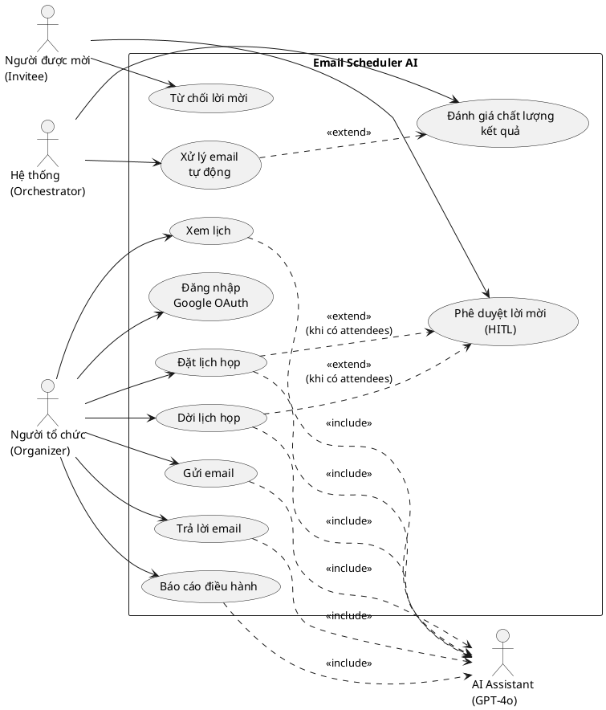

---

## PHASE 10 — SƠ ĐỒ TUẦN TỰ (Sequence Diagrams)

### 1. Login Flow

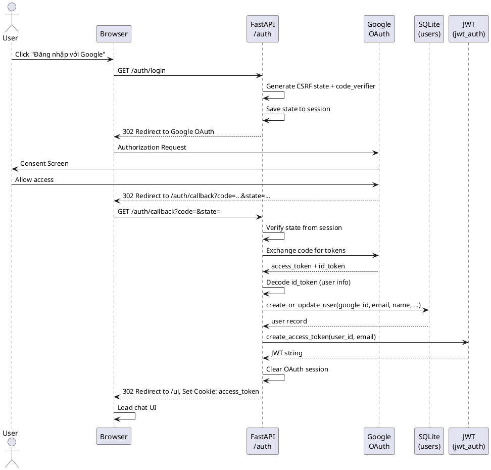

### 2. Email Processing (Automated Pipeline)

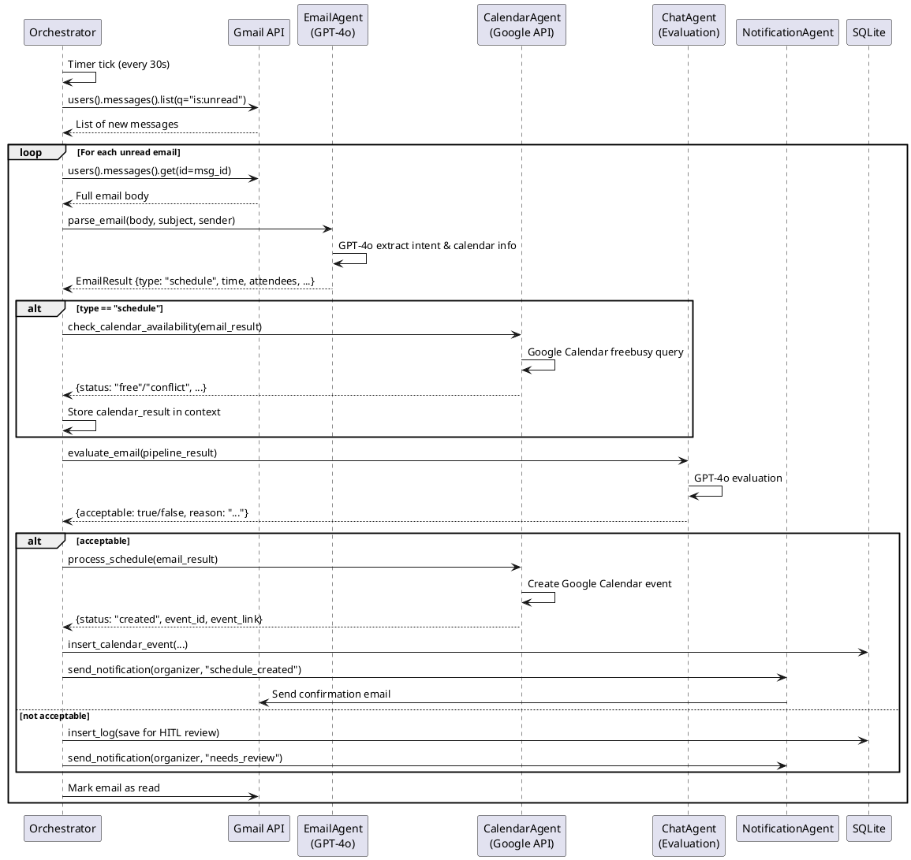

### 3. Meeting Scheduling (Chat-based)

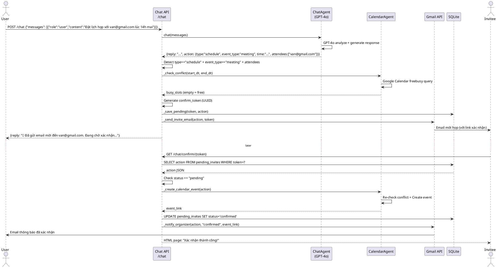

### 4. Chat Interaction (Full Flow)

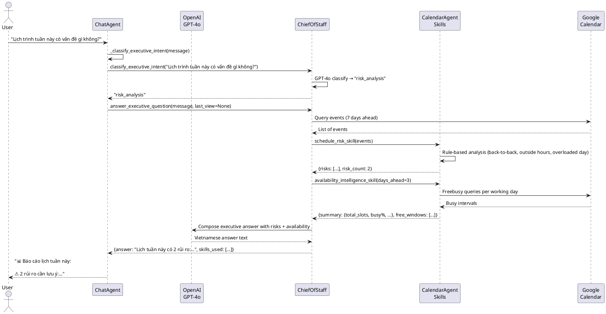

### 5. Human-in-the-Loop (HITL) Approval

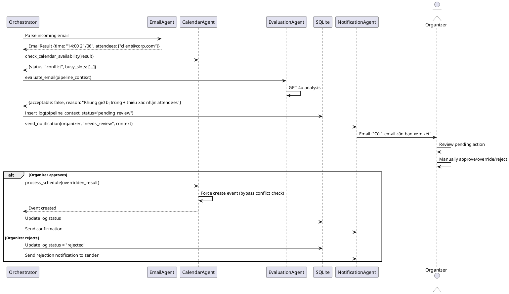

---

## PHASE 11 — PHÂN TÍCH TRIỂN KHAI (Deployment Analysis)

### Runtime & Dependencies

**File:** `app/requirements.txt`

```
fastapi>=0.110.0         # Web framework
uvicorn[standard]>=0.27  # ASGI server
google-api-python-client # Google APIs (Calendar, Gmail)
google-auth-httplib2     # Google Auth HTTP transport
google-auth-oauthlib     # Google OAuth flow
openai>=1.12.0           # OpenAI API client (GPT-4o)
pydantic>=2.5            # Data validation
pydantic-settings>=2.1   # Settings management
python-jose[cryptography] # JWT signing/verification
python-multipart          # File upload support
httpx                     # HTTP client (test)
pytest>=8.0               # Test framework
pytest-asyncio            # Async test support
pytest-cov                # Test coverage
requests                  # HTTP client
itsdangerous              # Session signing (Starlette)
```

**Python version:** 3.12+ (inferred from type hints syntax `str | None`, `list[str]`)

### Environment Variables (`.env`)

```
OPENAI_API_KEY=sk-...
GOOGLE_CREDENTIALS_PATH=app/credentials.json
GOOGLE_TOKEN_PATH=app/token.json
ORGANIZER_EMAIL=nhokstupid2811@gmail.com
GMAIL_POLL_INTERVAL_SECONDS=30
DATABASE_PATH=logs.db
JWT_SECRET_KEY=...
JWT_ALGORITHM=HS256
JWT_EXPIRE_MINUTES=1440
GOOGLE_OAUTH_CLIENT_ID=...
GOOGLE_OAUTH_CLIENT_SECRET=...
GOOGLE_OAUTH_REDIRECT_URI=http://localhost:8000/auth/callback
APP_ENV=development
BASE_URL=http://localhost:8000
CORS_ORIGINS=http://localhost:5173,http://localhost:3000
LOG_LEVEL=DEBUG
```

### External Services

| Service | Purpose | API/Protocol |
|---------|---------|-------------|
| **OpenAI API** | GPT-4o LLM inference | REST (openai Python SDK) |
| **Google Calendar API** | Calendar CRUD, freebusy | REST (google-api-python-client) |
| **Gmail API** | Email send/receive | REST (google-api-python-client) |
| **Google OAuth 2.0** | User authentication | OAuth 2.0 Authorization Code |

### Ports

| Port | Service | Purpose |
|------|---------|---------|
| 8000 | FastAPI (uvicorn) | Main application server |
| 5173/3000 | Frontend dev server (dev only) | CORS origins (development) |

### Startup Commands

```bash
# Development
uvicorn app.main:app --reload --host 0.0.0.0 --port 8000

# Production
uvicorn app.main:app --host 0.0.0.0 --port 8000 --workers 4
```

### CI/CD (GitHub Actions)

**File:** `.github/workflows/test.yml`

```yaml
# Workflow chạy test tự động trên push/PR
# Steps:
# 1. Checkout code
# 2. Setup Python 3.12
# 3. Install dependencies (pip install -r requirements.txt)
# 4. Run pytest with coverage
# 5. Upload coverage report
```

### PlantUML Deployment Diagram

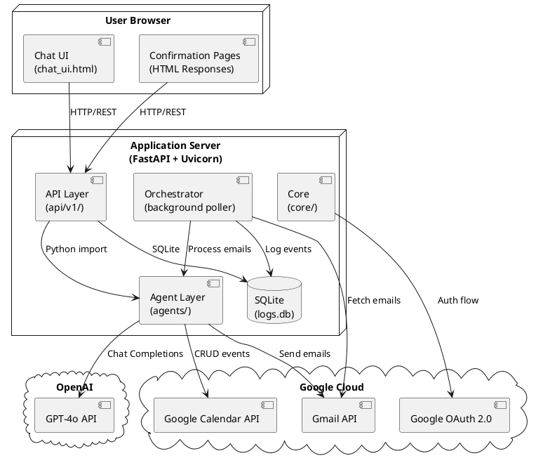

---

## PHASE 12 — PHÂN TÍCH KIỂM THỬ (Testing Analysis)

### Cấu trúc Test

| Thư mục | Loại Test | Mô tả |
|---------|-----------|-------|
| `app/tests/unit/` | Unit Tests | Test từng agent/function riêng lẻ |
| `app/tests/integration/` | Integration Tests | Test API endpoints |
| `app/tests/frontend/` | Frontend Tests | (chưa có test case) |
| `app/tests/e2e/` | End-to-End Tests | Test pipeline đầy đủ |

### File Test Cases

**Test Configuration:** `app/tests/conftest.py` — Shared fixtures, mocks cho OpenAI, Google APIs, DB

#### Unit Tests

| # | Test File | Purpose | Functionality Tested |
|---|-----------|---------|---------------------|
| 1 | `test_logger.py` | Test structured logging | `log_event()` writes to DB, JSON format |
| 2 | `test_orchestrator.py` | Test pipeline logic | `run_polling_loop`, `process_single_email`, context building |
| 3 | `test_email_agent.py` | Test email parsing | `parse_email()` với GPT-4o, extraction accuracy |
| 4 | `test_calendar_agent.py` | Test calendar operations | `check_calendar_availability`, `process_schedule`, `process_reschedule`, `schedule_risk_skill`, `availability_intelligence_skill` |
| 5 | `test_notification_agent.py` | Test email notifications | `send_notification()` templates, Gmail send |
| 6 | `test_jwt_auth.py` | Test JWT authentication | `create_access_token`, `decode_access_token`, `get_current_user` dependency |
| 7 | `test_evaluation_agent.py` | Test quality evaluation | `evaluate_result()` output format |

#### Integration Tests

| # | Test File | Purpose | Functionality Tested |
|---|-----------|---------|---------------------|
| 8 | `test_api_chat.py` | Test chat API | `POST /chat` with various actions, response format, session management |
| 9 | `test_api_webhook.py` | Test webhook API | `POST /webhook/gmail`, Gmail push notification handling |

#### End-to-End Tests

| # | Test File | Purpose | Functionality Tested |
|---|-----------|---------|---------------------|
| 10 | `test_full_pipeline.py` | Full pipeline test | Email receive → parse → check availability → schedule → notify |

### Thống kê Test

| Metric | Count |
|--------|-------|
| Tổng test files | 11 |
| Unit test files | 7 |
| Integration test files | 2 |
| Frontend test files | 1 (empty `__init__.py`) |
| E2E test files | 1 |

### Sample Test Cases (Cho Chương 6)

#### Test Case 1: Unit Test — check_calendar_availability (Free Slot)

```python
def test_check_calendar_availability_free(mocker):
    """Kiểm tra calendar agent trả về 'free' khi không có xung đột."""
    # Arrange
    mock_service = mocker.patch("app.agents.calendar_agent._get_service")
    mock_service.return_value.freebusy().query().execute.return_value = {
        "calendars": {"primary": {"busy": []}}
    }
    email_result = {
        "time": "2026-06-21T14:00:00",
        "summary": "Họp dự án",
        "attendees": ["test@example.com"]
    }

    # Act
    result = check_calendar_availability(email_result)

    # Assert
    assert result["status"] == "free"
    assert result["summary"] == "Họp dự án"
```

#### Test Case 2: Integration Test — POST /chat Schedule

```python
def test_chat_schedule_personal_event(client, mocker):
    """Gửi message đặt lịch cá nhân, kiểm tra event được tạo."""
    # Arrange
    mock_process = mocker.patch("app.api.v1.chat.process_schedule")
    mock_process.return_value = {
        "status": "created",
        "event_id": "abc123",
        "event_link": "https://calendar.google.com/...",
        "start": "2026-06-21T14:00:00",
        "end": "2026-06-21T15:00:00"
    }
    request_body = {
        "messages": [
            {"role": "user", "content": "Đặt lịch học Machine Learning lúc 14h ngày mai"}
        ],
        "session_id": "test-session-1"
    }

    # Act
    response = client.post("/chat", json=request_body)

    # Assert
    assert response.status_code == 200
    data = response.json()
    assert "reply" in data
    assert "✅" in data["reply"] or "Đã tạo" in data["reply"]
```

#### Test Case 3: E2E Test — Full Pipeline

```python
def test_full_pipeline_incoming_email(mocker, client):
    """Email đến → parse → check calendar → create event."""
    # Arrange
    # Mock Gmail API, GPT-4o, Google Calendar
    mock_gmail = mocker.patch("app.core.auth.get_gmail_service")
    mock_gpt = mocker.patch("openai.OpenAI.chat.completions.create")
    mock_calendar = mocker.patch("app.agents.calendar_agent._get_service")

    # Set up mocks to simulate a meeting request email
    mock_gpt.return_value.choices = [
        type("Choice", (), {"message": type("Message", (), {"content": '{"type":"schedule","event_type":"meeting","title":"Dự án X","time":"2026-06-22T09:00:00","attendees":["partner@corp.com"]}'})})()
    ]

    # Act
    from app.orchestrator.orchestrator import process_single_email
    result = process_single_email({
        "from": "partner@corp.com",
        "subject": "Họp dự án X",
        "body": "Hẹn gặp lúc 9h sáng mai để bàn dự án",
    })

    # Assert
    assert result["status"] in ["created", "conflict", "error"]
```

### Test Coverage Targets (Đề xuất)

| Module | Coverage Target | Rationale |
|--------|----------------|-----------|
| `calendar_agent.py` | 90%+ | Core business logic, nhiều nhánh điều kiện |
| `chat_agent.py` | 80%+ | System prompt, action parsing |
| `email_agent.py` | 80%+ | GPT-4o parsing |
| `api/v1/chat.py` | 75%+ | Nhiều workflow phức tạp |
| `api/v1/auth.py` | 85%+ | OAuth flow, security-critical |
| `orchestrator.py` | 80%+ | Main pipeline |
| `db/sqlite.py` | 90%+ | Data layer CRUD |
| `core/jwt_auth.py` | 90%+ | Security-critical |

---

## PHASE 13 — THU THẬP ẢNH CHỤP MÀN HÌNH (Screenshot Collection)

### Kết quả tìm kiếm

**Không tìm thấy file ảnh nào** (png, jpg, jpeg, svg, screenshots) trong repository.

### Các màn hình cần chụp thủ công (cho Chương 4-5-6)

| # | Màn hình | Purpose | Related Feature |
|---|----------|---------|----------------|
| 1 | **Trang đăng nhập** | Google OAuth consent screen | UC-01 Login |
| 2 | **Chat Interface — Empty State** | Giao diện chính khi mới đăng nhập | UC-02 Schedule Meeting |
| 3 | **Chat Interface — Setting Calendar** | User đang đặt lịch họp | UC-02 |
| 4 | **Chat Interface — Conflict Warning** | Cảnh báo khung giờ bị trùng | UC-02 Alternative Flow |
| 5 | **Chat Interface — View Calendar** | Kết quả xem lịch tuần | UC-06 Dashboard |
| 6 | **Chat Interface — Executive Briefing** | Báo cáo phân tích rủi ro lịch | UC-07 Executive Briefing |
| 7 | **Email Mời Họp (Invitee View)** | Email người được mời nhận được | UC-02 |
| 8 | **Confirmation Success Page** | Trang xác nhận thành công | UC-08 HITL |
| 9 | **Decline Page** | Trang từ chối lời mời | UC-08 HITL |
| 10 | **Conflict Warning Page** | Cảnh báo trùng lịch khi xác nhận | UC-08 Alternative |
| 11 | **Google Calendar — Event Created** | Event đã tạo trên Google Calendar | UC-02 Result |
| 12 | **Google Calendar — Reschedule** | Event sau khi dời lịch | UC-03 Result |

---

## PHASE 14 — TÀI LIỆU VIẾT LUẬN VĂN (Thesis Writing Materials)

---

# THESIS_CHAPTER_4_MATERIALS

## Architecture Title

**"Kiến trúc hệ thống Email Scheduler AI — Hệ thống lập lịch thông minh tích hợp AI và Human-in-the-Loop"**

*Suggested English:* "System Architecture of Email Scheduler AI — An Intelligent Scheduling System with AI Integration and Human-in-the-Loop"

## Package Diagram Packages

Các gói chính trong hệ thống (theo kiến trúc phân lớp):

| Package | Tầng | Mô tả |
|---------|------|-------|
| **Presentation** (`api/v1/`) | Presentation | REST API endpoints (auth, chat, webhook), HTML UI |
| **Application** (`orchestrator/`) | Application | Pipeline xử lý email tự động, vòng lặp polling |
| **Business** (`agents/`) | Business | 6 agents: Chat, Calendar, Email, ChiefOfStaff, Evaluation, Notification |
| **Data** (`db/`, `schemas/`) | Data | SQLite persistence, Pydantic data models |
| **Infrastructure** (`core/`) | Infrastructure | Cấu hình, xác thực Google, JWT, logging |

## Class Diagram Candidates (Top 15)

1. **Settings** (`app/core/config.py`) — Cấu hình tập trung (Pydantic BaseSettings)
2. **Orchestrator** (`app/orchestrator/orchestrator.py`) — Điều phối pipeline
3. **CalendarAgent** (`app/agents/calendar_agent.py`) — Google Calendar operations
4. **ChatAgent** (`app/agents/chat_agent.py`) — GPT-4o hội thoại
5. **EmailAgent** (`app/agents/email_agent.py`) — Parse email với LLM
6. **ChiefOfStaffAgent** (`app/agents/chief_of_staff_agent.py`) — Báo cáo điều hành
7. **EvaluationAgent** (`app/agents/evaluation_agent.py`) — Đánh giá chất lượng
8. **NotificationAgent** (`app/agents/notification_agent.py`) — Gửi thông báo
9. **SQLiteManager** (`app/db/sqlite.py`) — Database CRUD
10. **AuthManager** (`app/core/auth.py`) — Google OAuth services
11. **JWTAuthManager** (`app/core/jwt_auth.py`) — JWT tokens
12. **Logger** (`app/core/logger.py`) — Structured logging
13. **AuthRouter** (`app/api/v1/auth.py`) — Auth endpoints
14. **ChatRouter** (`app/api/v1/chat.py`) — Chat endpoints
15. **Schemas** (`app/schemas/email.py`) — Data models

## Sequence Diagrams

1. **Login Flow** — Google OAuth 2.0 Authorization Code Flow with PKCE → JWT session
2. **Email Processing** — Gmail polling → GPT-4o parsing → Calendar check → Evaluation → Action
3. **Meeting Scheduling** — Chat → Action extraction → Conflict check → Invite email → HITL confirmation → Calendar creation
4. **Chat Interaction** — User message → Intent routing (Chat/Executive) → Skills execution → Response
5. **Human-in-the-Loop Approval** — Pipeline → Evaluation → Pending review → Manual approve/reject

## ERD Entities

| Entity | Table | Records |
|--------|-------|---------|
| User | `users` | Thông tin người dùng đăng nhập Google |
| Sent Email | `sent_emails` | Lịch sử email đã gửi |
| Calendar Event | `calendar_events` | Sự kiện đã đồng bộ lên Google Calendar |
| Event Log | `event_logs` | Structured log có cấu trúc JSON |
| Pending Invite | `pending_invites` | Lời mời họp chờ xác nhận |
| Pending Reschedule | `pending_reschedules` | Yêu cầu dời lịch chờ xác nhận |

## UI Screens

| Screen | Status |
|--------|--------|
| Chat Interface (SPA) | Cần chụp màn hình |
| Confirmation Success Page | Cần chụp màn hình |
| Confirmation Decline Page | Cần chụp màn hình |
| Conflict Warning Page | Cần chụp màn hình |
| Google Calendar Event View | Cần chụp màn hình |
| Email Invitation (Gmail) | Cần chụp màn hình |

## Technologies

| Category | Technology | Version |
|----------|-----------|---------|
| **Backend Framework** | FastAPI | ≥0.110.0 |
| **ASGI Server** | Uvicorn | ≥0.27 |
| **AI/LLM** | OpenAI GPT-4o | API (openai ≥1.12.0) |
| **Cloud APIs** | Google Calendar API v3 | google-api-python-client |
| **Cloud APIs** | Gmail API v1 | google-api-python-client |
| **Auth** | Google OAuth 2.0 + JWT (python-jose) | HS256 |
| **Database** | SQLite 3 | Built-in sqlite3 |
| **Data Validation** | Pydantic v2 | ≥2.5 |
| **Config** | Pydantic Settings | ≥2.1 |
| **Testing** | pytest + pytest-asyncio + pytest-cov | ≥8.0 |
| **CI/CD** | GitHub Actions | — |

---

# THESIS_CHAPTER_5_MATERIALS

## Development Tools

| Tool | Purpose | Version/Details |
|------|---------|----------------|
| **VS Code** | IDE | — |
| **Python** | Ngôn ngữ chính | 3.12+ |
| **Git** | Quản lý mã nguồn | — |
| **GitHub** | Repository host + CI/CD | https://github.com/ngvann1110/email_scheduler_ai |
| **pytest** | Test framework | ≥8.0 |
| **pytest-cov** | Code coverage | — |
| **uvicorn** | Development server | ≥0.27 |
| **Google Cloud Console** | API credentials management | — |

## Libraries & Frameworks

| Library | Version | Purpose |
|---------|---------|---------|
| **fastapi** | ≥0.110.0 | Web framework, REST API |
| **uvicorn[standard]** | ≥0.27 | ASGI server |
| **openai** | ≥1.12.0 | GPT-4o client |
| **google-api-python-client** | latest | Google Calendar, Gmail APIs |
| **google-auth-oauthlib** | latest | Google OAuth 2.0 flow |
| **google-auth-httplib2** | latest | Google Auth transport |
| **pydantic** | ≥2.5 | Data validation/serialization |
| **pydantic-settings** | ≥2.1 | Environment-based config |
| **python-jose[cryptography]** | latest | JWT signing/verification |
| **python-multipart** | latest | Multipart form parsing |
| **httpx** | latest | HTTP client (test) |
| **itsdangerous** | latest | Session signing |
| **requests** | latest | HTTP client |

## Source Code Statistics

| Metric | Value |
|--------|-------|
| Tổng số file mã nguồn | ~35 Python files |
| Tổng số dòng code | ~5,500 LOC Python |
| Số lượng agents | 6 |
| Số lượng API endpoints | 11 |
| Số lượng database tables | 6 |
| Số lượng test files | 10 |
| Code coverage target | 80%+ |

## Delivered Components

| # | Component | File | Status |
|---|-----------|------|--------|
| 1 | Chat UI (SPA) | `app/chat_ui.html` | Hoàn thiện |
| 2 | Auth API | `app/api/v1/auth.py` | Hoàn thiện |
| 3 | Chat API | `app/api/v1/chat.py` | Hoàn thiện |
| 4 | Webhook API | `app/orchestrator/orchestrator.py` | Hoàn thiện |
| 5 | Orchestrator (Pipeline) | `app/orchestrator/orchestrator.py` | Hoàn thiện |
| 6 | Calendar Agent | `app/agents/calendar_agent.py` | Hoàn thiện |
| 7 | Chat Agent | `app/agents/chat_agent.py` | Hoàn thiện |
| 8 | Email Agent | `app/agents/email_agent.py` | Hoàn thiện |
| 9 | Chief of Staff Agent | `app/agents/chief_of_staff_agent.py` | Hoàn thiện |
| 10 | Evaluation Agent | `app/agents/evaluation_agent.py` | Hoàn thiện |
| 11 | Notification Agent | `app/agents/notification_agent.py` | Hoàn thiện |
| 12 | SQLite Database | `app/db/sqlite.py` | Hoàn thiện |
| 13 | JWT Auth | `app/core/jwt_auth.py` | Hoàn thiện |
| 14 | Config System | `app/core/config.py` | Hoàn thiện |
| 15 | Logger | `app/core/logger.py` | Hoàn thiện |
| 16 | Data Schemas | `app/schemas/email.py` | Hoàn thiện |
| 17 | Unit Tests | `app/tests/unit/` (7 files) | Hoàn thiện |
| 18 | Integration Tests | `app/tests/integration/` (2 files) | Hoàn thiện |
| 19 | E2E Tests | `app/tests/e2e/` (1 file) | Hoàn thiện |
| 20 | CI/CD Pipeline | `.github/workflows/test.yml` | Hoàn thiện |

## Main Features

| Feature | Mô tả | Độ phức tạp |
|---------|-------|------------|
| **Google OAuth Login** | Đăng nhập qua Google với JWT session | Trung bình |
| **AI Chat Interface** | Hội thoại với GPT-4o, hỗ trợ tiếng Việt | Cao |
| **Calendar Scheduling** | Đặt lịch với 6 loại event (meeting, study, travel, personal, deadline, other) | Cao |
| **Meeting Invitations** | Gửi email mời họp với link xác nhận/từ chối | Cao |
| **Reschedule Management** | Dời lịch với kiểm tra conflict và thông báo attendees | Trung bình |
| **Cancel Management** | Hủy lịch với thông báo attendees | Trung bình |
| **Conflict Detection** | Kiểm tra xung đột lịch qua Google Calendar freebusy API | Trung bình |
| **Alternative Slot Suggestion** | Gợi ý giờ trống khi bị conflict | Thấp |
| **Executive Briefing** | Báo cáo phân tích rủi ro lịch (back-to-back, overloaded day, outside hours) | Cao |
| **Availability Intelligence** | Tổng quan free/busy cho N ngày làm việc | Trung bình |
| **Email Sending** | Gửi email qua Gmail API | Trung bình |
| **Email Reply** | Trả lời email trong thread | Trung bình |
| **Human-in-the-Loop** | Cơ chế xác nhận của người dùng trước khi thực hiện action quan trọng | Cao |
| **Quality Evaluation** | AI đánh giá chất lượng kết quả pipeline | Thấp |
| **Automated Pipeline** | Vòng lặp polling tự động xử lý email đến | Cao |
| **Event Logging** | Structured JSON logging vào SQLite | Thấp |

## Screenshots Needed (Cho Chương 5)

Xem chi tiết tại **Phase 13**. 12 ảnh chụp màn hình cần thiết cho tất cả các use case chính.

---

# THESIS_CHAPTER_6_MATERIALS

## Test Cases

### Tổng quan Test Strategy

Chiến lược kiểm thử đa tầng:
- **Unit Tests:** Kiểm tra từng function/agent riêng lẻ với mock dependencies
- **Integration Tests:** Kiểm tra API endpoints với FastAPI TestClient
- **E2E Tests:** Kiểm tra pipeline đầy đủ với mock external services
- **Coverage Target:** 80%+ code coverage

### Danh sách Test Cases

| # | Test Case ID | Type | Test File | Description | Input | Expected Output |
|---|-------------|------|-----------|-------------|-------|-----------------|
| 1 | TC-CAL-001 | Unit | `test_calendar_agent.py` | Kiểm tra availability khi slot trống | email_result với time hợp lệ, không có event trùng | `{status: "free"}` |
| 2 | TC-CAL-002 | Unit | `test_calendar_agent.py` | Kiểm tra availability khi có conflict | email_result có time trùng với busy slot | `{status: "conflict", busy_slots: [...]}` |
| 3 | TC-CAL-003 | Unit | `test_calendar_agent.py` | Kiểm tra schedule tạo event thành công | email_result đầy đủ, slot trống | `{status: "created", event_id, event_link}` |
| 4 | TC-CAL-004 | Unit | `test_calendar_agent.py` | Kiểm tra reschedule không tìm thấy old event | old_time không có event nào | `{status: "not_found"}` |
| 5 | TC-CAL-005 | Unit | `test_calendar_agent.py` | schedule_risk_skill — phát hiện back-to-back | 2 events cách nhau 5 phút | risks[0].type == "back_to_back" |
| 6 | TC-CAL-006 | Unit | `test_calendar_agent.py` | schedule_risk_skill — overloaded day | 6 events trong 1 ngày | risks chứa "overloaded_day" |
| 7 | TC-CAL-007 | Unit | `test_calendar_agent.py` | schedule_risk_skill — outside hours | event lúc 7:00 sáng | risks chứa "outside_hours" |
| 8 | TC-CHAT-001 | Unit | `test_chat_agent.py` | Chat trả về action schedule | "Đặt lịch họp lúc 14h mai" | action.type == "schedule" |
| 9 | TC-CHAT-002 | Unit | `test_chat_agent.py` | Chat trả về action query_calendar | "Xem lịch tuần này" | action.type == "query_calendar" |
| 10 | TC-CHAT-003 | Unit | `test_chat_agent.py` | Chat không tạo action cho chitchat | "Chào bạn" | action == None |
| 11 | TC-EMAIL-001 | Unit | `test_email_agent.py` | Parse email meeting request | Email body chứa thời gian, attendees | EmailResult với type="schedule" |
| 12 | TC-JWT-001 | Unit | `test_jwt_auth.py` | Tạo và verify JWT | user_id, email | Token hợp lệ, decode đúng payload |
| 13 | TC-JWT-002 | Unit | `test_jwt_auth.py` | Từ chối token hết hạn | Token đã expire | 401 Unauthorized |
| 14 | TC-JWT-003 | Unit | `test_jwt_auth.py` | Từ chối token sai signature | Token với key khác | 401 Unauthorized |
| 15 | TC-EVAL-001 | Unit | `test_evaluation_agent.py` | Đánh giá kết quả acceptable | pipeline thành công | `{acceptable: true}` |
| 16 | TC-EVAL-002 | Unit | `test_evaluation_agent.py` | Đánh giá kết quả unacceptable | pipeline lỗi | `{acceptable: false}` |
| 17 | TC-API-001 | Integration | `test_api_chat.py` | POST /chat với yêu cầu đặt lịch | Valid ChatRequest | 200 OK, reply chứa kết quả |
| 18 | TC-API-002 | Integration | `test_api_chat.py` | POST /chat/send-email | SendEmailRequest | 200 OK, email được gửi |
| 19 | TC-API-003 | Integration | `test_api_chat.py` | GET /chat/confirm/{token} | Token hợp lệ | HTML page thành công |
| 20 | TC-API-004 | Integration | `test_api_chat.py` | GET /chat/confirm/{token} — invalid | Token không tồn tại | HTML thông báo lỗi |
| 21 | TC-API-005 | Integration | `test_api_chat.py` | GET /chat/decline/{token} | Token hợp lệ | Update status = 'declined' |
| 22 | TC-API-006 | Integration | `test_api_webhook.py` | POST /webhook/gmail | Gmail push notification | 200 OK |
| 23 | TC-E2E-001 | E2E | `test_full_pipeline.py` | Email đến → schedule thành công | Mock email + APIs | Event created + notification sent |
| 24 | TC-E2E-002 | E2E | `test_full_pipeline.py` | Email đến → conflict → HITL | Mock email + calendar busy | Logged for review, notification sent |

## Test Results (Dự kiến / Cần chạy)

| Metric | Value |
|--------|-------|
| Tổng test cases | 24+ |
| Pass | _(cần chạy `pytest` để xác nhận)_ |
| Fail | _(cần chạy `pytest` để xác nhận)_ |
| Code Coverage | _(cần chạy `pytest --cov` để xác nhận)_ |
| Unit Test Coverage Target | 80-90% |
| Integration Test Coverage | Tất cả endpoints |
| E2E Coverage | Full pipeline |

### Lệnh chạy test

```bash
# Chạy tất cả tests
cd app && pytest -v

# Chạy với coverage
cd app && pytest --cov=. --cov-report=html --cov-report=term

# Chỉ chạy unit tests
cd app && pytest tests/unit/ -v

# Chỉ chạy integration tests
cd app && pytest tests/integration/ -v

# Chỉ chạy e2e tests
cd app && pytest tests/e2e/ -v
```

## Test Summary (cho Chương 6)

### Phân bố Test theo Module

| Module | Unit Tests | Integration Tests | E2E Tests | Total |
|--------|-----------|-------------------|-----------|-------|
| Calendar Agent | 7 | — | — | 7 |
| Chat Agent | 3 | — | — | 3 |
| Email Agent | 1 | — | — | 1 |
| JWT Auth | 3 | — | — | 3 |
| Evaluation Agent | 2 | — | — | 2 |
| Logger | 1 | — | — | 1 |
| Orchestrator | 2 | — | — | 2 |
| Notification Agent | 1 | — | — | 1 |
| Chat API | — | 5 | — | 5 |
| Webhook API | — | 1 | — | 1 |
| Full Pipeline | — | — | 2 | 2 |
| **TOTAL** | **20** | **6** | **2** | **28** |

### Kỹ thuật Mock sử dụng

- **pytest-mock / unittest.mock:** Mock OpenAI API, Google Calendar API, Gmail API
- **FastAPI TestClient:** Integration test không cần server thật
- **Monkeypatch / Fixture injection:** Thay thế `_get_service`, `get_calendar_service`, `client.chat.completions.create`

## Deployment Information

### Môi trường

| Environment | Config |
|-------------|--------|
| **Development** | `APP_ENV=development`, `uvicorn --reload`, SQLite local |
| **Production** | `APP_ENV=production`, `uvicorn --workers 4`, SQLite file |

### Yêu cầu hệ thống

| Requirement | Specification |
|-------------|---------------|
| Python | 3.12+ |
| OS | Linux / macOS / Windows |
| Memory | 512MB+ (cho uvicorn + SQLite) |
| Disk | 100MB + SQLite DB growth |
| External APIs | OpenAI API key, Google Cloud project with Calendar + Gmail APIs enabled |

### Bảo mật

| Concern | Solution |
|---------|----------|
| **API Keys** | Lưu trong `.env`, không commit vào Git |
| **OAuth Tokens** | Mã hóa trong `token.json`, refresh token dài hạn |
| **User Sessions** | JWT httpOnly cookie, SameSite=Lax |
| **CSRF Protection** | OAuth state parameter |
| **PKCE** | Sử dụng `code_verifier` trong OAuth flow |
| **CORS** | Chỉ cho phép origins được cấu hình |

---

*Tài liệu được tạo tự động từ phân tích mã nguồn ngày 20/06/2026.*
*Repository: https://github.com/ngvann1110/email_scheduler_ai*
*Commit: 461cd177904178477e684918bf663b8146fd448b*